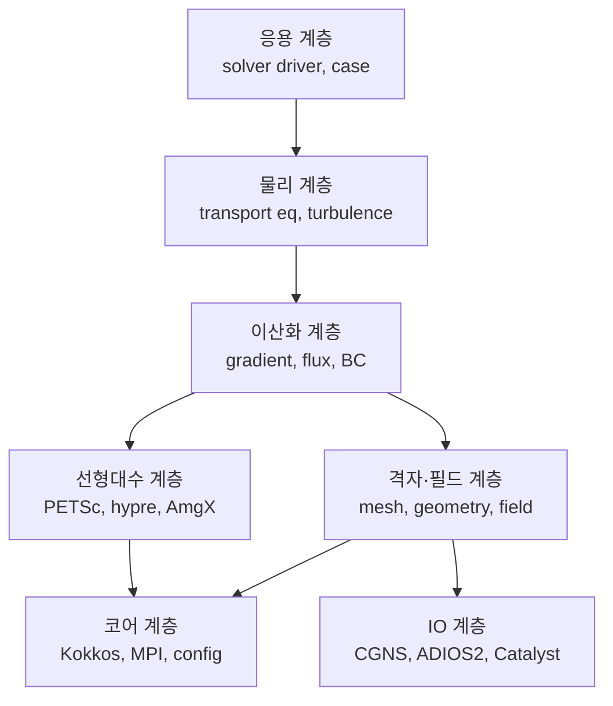

# CFD 솔버 아키텍처 및 개발 로드맵

Sep 21, 2026 · @Joy

3차원 나비에-스톡스 해석 프로그램을 오픈소스 라이브러리 조립 방식으로 개발하기 위한 아키텍처 결정과 단계별 실행 계획.

## 목표와 범위 결정

오픈소스로 공개하는 3차원 비정렬 격자 CFD 솔버를 라이브러리 조립 방식으로 개발하며, 워크스테이션급 CPU+GPU에서 동작시킨다. 전처리와 후처리를 모두 포함한다.

| 항목 | 결정 | 설계에 미치는 영향 |
| --- | --- | --- |
| 배포 방식 | 오픈소스 공개 | GPL 계열 사용 제약이 없음. gmsh·cfMesh·ParaView 전부 가용 |
| 개발 전략 | 라이브러리 조립형 | 이산화·물리 계층만 자체 구현. 격자·선형해석·IO·시각화는 외부 라이브러리 |
| 목표 하드웨어 | CPU + GPU 가속 | Kokkos를 자료구조 계층에 처음부터 도입. 나중 추가는 사실상 전면 재작성 |
| 문제 규모 | 단일 노드, 수백만\~수천만 셀 | MPI + GPU. 클러스터 확장은 설계만 열어둠 |

물리 범위는 네 영역(비압축성 난류, 압축성, 열전달·부력·공액열전달, 다상유동)을 모두 목표로 두되, v1 범위가 아니라 로드맵 순서로 다룬다. 네 영역을 동시에 구현하는 것은 code\_saturne·ExaWind와 같은 급의 작업량이며, 두 프로젝트 모두 기관 규모 팀이 10년 이상 투입한 결과물이다.

압축성과 비압축성은 압력기반과 밀도기반으로 해석 경로 자체가 달라 사실상 별개의 솔버다. 초기 설계에서 플럭스 계층만 추상화해 두고 구현은 순차 진행한다.

## 기술 스택

직접 구현하는 것은 이산화와 물리 계층뿐이다. 나머지는 전부 검증된 외부 라이브러리를 쓴다.

| 계층 | 선택 | 라이선스 | 근거 |
| --- | --- | --- | --- |
| 형상 커널 | [OpenCASCADE](https://dev.opencascade.org/) | LGPL-2.1 | STEP·IGES 임포트. gmsh가 내장 |
| 격자 생성 | [gmsh](https://gmsh.info/) + [cfMesh](https://cfmesh.com/cfmesh-open-source/) | GPL | gmsh는 Python API로 자동화, 경계층 육면체는 cfMesh로 보완 |
| 격자 분할 | ParMETIS / Zoltan2 | 자유 | MPI 도메인 분할 |
| 커널 이식성 | [Kokkos](https://kokkos.org/) | Apache-2.0 | CPU+GPU 요구의 핵심. CUDA·HIP·SYCL을 단일 코드로 |
| 선형해석 상위 API | [PETSc](https://petsc.org/) | BSD-2 | 백엔드를 런타임에 교체. GPU 지원 성숙 |
| 압력 Poisson | hypre BoomerAMG 또는 AmgX | Apache-2.0 / 자유 | 비압축성 해석시간의 60\~80%가 여기. 성능을 사실상 결정 |
| 데이터·IO | CGNS(HDF5) + [ADIOS2](https://adios2.readthedocs.io/) | 자유 / Apache-2.0 | CGNS를 표준 포맷으로, 대용량 병렬 출력은 ADIOS2 |
| 후처리 | VTK + ParaView + [Catalyst 2](https://docs.paraview.org/en/latest/Catalyst/index.html) | BSD | 수천만 셀부터 디스크 IO가 병목. in-situ가 필수 |
| 멀티피직스 결합 | [preCICE](https://precice.org/) | LGPL-3.0 | 공액열전달·FSI 확장 시 |
| 빌드 | Spack + CMake | 자유 | 이 의존성 더미를 재현 가능하게 빌드하는 사실상 표준 |

코어 코드는 Apache-2.0으로 내고, GPL 도구(gmsh, cfMesh)는 라이브러리로 링크하지 않고 별도 프로세스로 호출하는 것을 권장한다. 향후 라이선스 정책이 바뀔 여지를 남긴다.

## 레퍼런스 아키텍처

처음부터 짜기 전에 이 두 프로젝트의 계층 분리를 먼저 읽고 그대로 차용한다. 설계 리스크를 가장 크게 줄이는 방법이다.

| 프로젝트 | 라이선스 | 겹치는 지점 | 가져올 것 |
| --- | --- | --- | --- |
| [code\_saturne](https://github.com/code-saturne/code_saturne) (EDF) | GPL-2.0 | 비압축성·저마하 + 난류 + 열전달, CGNS·MED, PETSc·AmgX·hypre, Catalyst in-situ | 목표 지점이 거의 동일. 격자·필드 추상화와 다중 선형해석기 연결 방식 |
| [Nalu-Wind / ExaWind](https://github.com/Exawind/nalu-wind) (NREL·Sandia) | BSD-3 | 비정렬 + 블록정렬 AMR 하이브리드, Kokkos·Trilinos·hypre GPU | GPU 설계의 교과서. Kokkos 커널 구성과 메모리 레이아웃 |

포크하지 않고 직접 짜는 근거는 하나여야 한다 — code\_saturne은 Fortran 유산이 남아 있고 GPU 포팅이 부분적이며, Nalu-Wind는 풍력 도메인에 특화돼 있다. 처음부터 Kokkos 기반으로 깔끔하게 쓰면 GPU 병목을 구조적으로 피할 수 있다는 것이 유일한 정당화다. 이 근거가 약해지면 v1 시점에 포크로 선회하는 것이 맞다.

## 계층 구조

계층 간 인터페이스는 사람이 먼저 고정하고, 각 계층의 구현은 AI가 채운다. 이 경계가 바이브코딩을 안전하게 만드는 유일한 장치다.

사람이 고정할 것 — 격자 자료구조(SoA 레이아웃, 면 기반 연결성), 필드 컨테이너 API, 경계조건 인터페이스, 플럭스 추상화(압력기반·밀도기반 분기점), 선형해석기 래퍼 시그니처.

AI가 채울 것 — 기하량 계산, 기울기 · 라플라시안 · 대류항 이산화, 비직교 보정, 난류 모델 소스항, CGNS 파서, 벤치마크 케이스 설정.

디렉토리 레이아웃은 `src/` 아래 `core` · `mesh` · `field` · `discretization` · `linalg` · `physics` · `io`로 계층과 1:1 대응시키고, 각 디렉토리가 자기 보다 하위 계층만 참조하도록 CMake 타겟 의존성으로 강제한다.

## 단계별 로드맵

각 단계는 게이트를 통과해야 다음으로 넘어간다. 기간은 AI 보조를 적극 활용한 1인 기준 추정이다.

| 단계 | 내용 | 기간 | 통과 게이트 |
| --- | --- | --- | --- |
| v0 기반 | Kokkos 격자 자료구조, CGNS 읽기, FVM 기하량, PETSc 연결, 스칼라 Laplace | 2\~3개월 | MMS 공간 수렴차수 2.0, 비직교 격자에서도 유지 |
| v1 비압축성 층류 | fractional step 또는 SIMPLE·PISO, 3D, MPI | 3\~6개월 | Taylor–Green 해석해, Ghia cavity, 원통 Re=100 St≈0.164 |
| v2 난류 + 열전달 | k-ω SST, 벽함수, 에너지 방정식, Boussinesq 부력, 공액열전달 | 6\~12개월 | 평판 경계층 Cf 상관식, 후향계단 재부착 길이, Rayleigh–Bénard 임계 Ra |
| v2.5 GPU 포팅 | 커널 GPU 실행, 압력해석기 hypre-GPU·AmgX | 2\~4개월 | v1·v2 전 케이스가 CPU와 동일 결과, 실측 speedup 기록 |
| v3 압축성 | 밀도기반 경로 추가, Riemann 해법기, 제한자 | 6\~12개월 | Sod shock tube, NACA0012 천음속 |
| v4 다상유동 | VOF, 표면장력 | 6개월+ | dam break, rising bubble |

v1까지가 6\~12개월, v2까지 추가 1년 이상이다. 전 범위는 팀 규모의 일이다.

GPU 포팅을 v2.5에 둔 이유는 검증된 CPU 기준과 비교할 대상이 있어야 하기 때문이다. 다만 자료구조는 v0부터 Kokkos로 가야 하며, 그렇지 않으면 v2.5가 포팅이 아니라 재작성이 된다.

## 검증 전략

CFD 코드는 틀려도 돌아가고 틀려도 그럴듯한 그림을 낸다. 그래서 게이트 테스트를 해당 단계 코드보다 먼저 작성해 CI에 올린다.

가장 중요한 것은 제조해 검증(MMS)이다. 임의의 해 함수를 가정하고 지배방정식에 대입해 원천항을 역산한 뒤, 격자를 조이며 오차가 이론 차수대로 줄어드는지 실측한다. 2차 기법이라면 log-log 기울기가 2.0이 나와야 하고, 1.5로 떨어지면 이산화에 버그가 있는 것이다.

단계별 벤치마크와 기준값:

| 케이스 | 단계 | 기준값 |
| --- | --- | --- |
| MMS 스칼라 확산·대류 | v0 | 수렴차수 2.0 ± 0.1 |
| Taylor–Green vortex | v1 | 해석해 대비 L2 오차, 시간 2차 수렴 |
| Lid-driven cavity Re=100·1000 | v1 | Ghia et al. (1982) 중심선 속도 프로파일 |
| 원통 후류 Re=100 | v1 | Strouhal ≈ 0.164, Cd ≈ 1.33 |
| 평판 경계층 | v2 | Cf 상관식, 로그칙 프로파일 |
| 후향계단 Re=5100 | v2 | 재부착 길이 실험치 대비 |
| Rayleigh–Bénard | v2 | 임계 Ra ≈ 1708 |
| Sod shock tube | v3 | 해석해 대비 충격파 위치·강도 |
| Dam break | v4 | Martin & Moyce 실험치 |

보존량 모니터링도 매 스텝 로그로 남긴다. 질량 불균형이 기계정밀도 수준을 벗어나면 그 시점에 잔다.

CI는 가벼운 MMS·단위 테스트를 매 커밋, 무거운 벤치마크를 야간 배치로 돌린다. 이 스위트가 있어야 AI가 솔버 내부를 통째로 갈아엎어도 안전하다.

## 리스크와 미결정 항목

가장 큰 리스크는 범위다. 네 물리 영역을 동시에 손대면 어느 것도 검증 게이트를 통과하지 못한 채 v1이 무한히 미뤄진다.

| 리스크 | 신호 | 대응 |
| --- | --- | --- |
| 범위 확산 | v1 게이트 전에 v2·v3 코드가 들어옴 | 게이트 미통과 시 새 물리 추가 금지를 규칙으로 |
| 조용한 오답 | 결과는 나오는데 검증 없음 | MMS·벤치마크를 코드보다 먼저 작성 |
| GPU 재작성 | v0에서 Kokkos를 건너뜀 | 자료구조 계층을 처음부터 Kokkos로 |
| 의존성 지옥 | 빌드가 환경마다 깨짐 | Spack 환경을 저장소에 고정, 컨테이너 이미지 제공 |
| 라이선스 오염 | GPL 도구를 라이브러리로 링크 | gmsh·cfMesh는 별도 프로세스로만 호출 |

아직 결정하지 않은 항목:

- [ ] 압축성과 비압축성을 통합 all-Mach 경로로 갈지, 별도 밀도기반 경로로 갈지 (v1 종료 시점에 결정)
- [ ] 이산화를 셀중심형 FVM으로 고정할지, 고차 정확도 여지를 남길지
- [ ] AMR을 범위에 넣을지 (넣는다면 AMReX 도입 검토 필요)
- [ ] 저장소 이름과 코어 라이선스 확정 (현재 Apache-2.0 가정)

## 진행 현황

v0 게이트를 통과했다. 저장소 이름은 `nsflow`로 잡아두었다가, 공개하면서 Vibeflow로 바꿨다 (9차).

완료된 것:

- 비직교 육면체 격자 생성과 FVM 기하량 — 면 폐합 오차 1e-18, 체적 합 정확히 1.0
- 과이완화(over-relaxed) 비직교 보정 확산 연산자 + 최소자승 기울기
- MMS 검증 하니스와 CI 워크플로우
- 코어·격자·이산화·선형대수 계층의 C++ 인터페이스 헤더, 계층 의존성을 강제하는 CMake 구성
- Spack 환경, 라이선스 경계 문서, ADR 결정 로그

v0 MMS 결과 — 네 조합 모두 2차 수렴:

| 해 | 격자 | N=8 | N=16 | N=32 | 수렴차수 |
| --- | --- | --- | --- | --- | --- |
| A sin·sin·sin | 직교 | 4.579e-03 | 1.138e-03 | 2.841e-04 | 2.002 |
| A | 비직교 25.65° | 5.607e-03 | 1.338e-03 | 3.252e-04 | 2.041 |
| B exp·sin | 직교 | 6.772e-03 | 1.719e-03 | 4.328e-04 | 1.990 |
| B | 비직교 25.65° | 8.007e-03 | 2.065e-03 | 5.286e-04 | 1.966 |

검증 과정에서 게이트 자체의 허점을 하나 발견했다. 해 A는 경계에서 전부 0이라 Dirichlet 계수가 실행되지 않는다. 경계값이 0이 아닌 해 B를 추가해야 게이트가 성립한다.

### C++ 이식 완료 (2차)

Python 참조 구현을 Kokkos 기반 C++로 옮겼다. 격자 기하량, 최소자승 기울기, 비직교 보정 확산 연산자, 그리고 의존성 없는 CG 해석기를 포함한다. C++는 격자를 생성하지 않고 점을 읽어들인다 — 나중 CGNS 리더가 들어올 자리를 그대로 만들어둔 것이다.

활성 게이트 네 개가 모두 통과한다:

| 게이트 | 결과 |
| --- | --- |
| python: MMS 확산 | 네 조합 모두 2차 (1.966\~2.041) |
| c++: 격자 기하량 vs Python 픽스처 | 면적벼·면중심 비트 일치, 셀중심 4.4e-16, 체적 8.7e-19 |
| c++: MMS 확산 | 동일하게 2차 |
| 교차검증: Python vs C++ | 12개 조합 최대 상대차 1.6e-12 |

교차검증이 가장 중요하다. 두 구현은 코드를 공유하지 않고 선형해석기도 다르다(scipy 희소 직접법 vs Kokkos CG). 독립적인 12개 케이스가 1.6e-12로 일치하는 것은 한 구현만으로는 얻을 수 없는 증거다.

ADR-002도 검증됐다. 자료구조가 처음부터 Kokkos 뷰이라 GPU 백엔드로 바꾸는 것은 빌드 옵션 변경이며 솔버 코드는 그대로다.

### v0 완료 (3차)

전처리·후처리·병렬·선형해석 경로가 모두 붙었다. 게이트가 네 개에서 여덟 개로 늘었고 전부 통과한다.

| 추가된 것 | 결과 |
| --- | --- |
| ParaView 출력 | base64 .vtu / .pvtu 직접 작성, VTK 라이브러리 불필요. meshio로 왕복 검증 |
| CGNS 리더 | 외부 파일에서 면 위상을 꼭짓점 매칭으로 재발견. 기하량 일치 7e-18 |
| MPI 분할 | RCB 분할 + 고스트 셀 + 헤일로 교환. 1/2/3/4 랭크 동일 해 (9e-14) |
| PETSc 백엔드 | 런타임 문자열로 솔버·전처리 선택. 네 설정 모두 동일 해 (1.4e-13) |

4096셀에서 동일 계에 대한 반복 횟수 — BoomerAMG 7회, Jacobi-CG 92회. 압력 Poisson에서 전처리가 왜 결정적인지가 그대로 나타난다.

MPI 게이트가 특히 중요하다. 헤일로 교환이 틀려도 해는 수렴하고 그럴듯해 보이며, 다만 랭크 수에 따라 답이 달라질 뿐이다. 이걸 잡는 게이트는 이것 하나다.

### 지금 결정해야 할 것

v1 코드를 시작하기 전에 정해야 하는 순서대로 정리했다. 앞의 세 개는 v1 설계를 직접 바꾸고, 뒤의 세 개는 나중에 정해도 된다.

| # | 결정 | 선택지 | 언제까지 |
| --- | --- | --- | --- |
| 1 | 압력-속도 연성 | 분리법(fractional step) — 비정상·LES에 유리 / SIMPLE·PISO — 정상해·큰 시간간격에 유리 | v1 시작 전 |
| 2 | 변수 배치 | 공위치(collocated) + Rhie-Chow 보간 / 엇갈림(staggered) | v1 시작 전 |
| 3 | 시간 적분 | 2차 암묵적(Crank-Nicolson·BDF2) / 반암묵 투스텍 | v1 시작 전 |
| 4 | 분할기 교체 | 현재 RCB는 전체 격자를 모든 랭크가 읽는다(ADR-006). ParMETIS + 병렬 CGNS 읽기로 교체 | v2 실형상 전 |
| 5 | 대류항 이산화 | 2차 중심차분 / TVD 제한자 / 혼합 | v1 중반 |
| 6 | GPU 백엔드 시점 | v2.5 예정을 유지할지, v1 직후로 당길지 | v1 종료 시 |

1번과 2번은 사실상 한 묶음이다. 공위치 + Rhie-Chow가 비정렬 격자의 사실상 표준이고 구현도 간단하지만, 보간 계수가 시간간격에 의존하는 알려진 함정이 있어 검증 케이스를 미리 잡아두어야 한다.

3번은 게이트와 직결된다. Taylor-Green은 시간 2차 수렴을 측정하는 케이스라, 시간 적분법을 정해야 게이트를 먼저 쓸 수 있다.

4번은 기한을 명시해둔다. 현재 구조는 한 랭크에 들어가는 격자가 상한이라 MPI의 의미가 절반뿐이다. 다만 `PartitionMethod`와 `HaloExchange`가 이음새라 `mesh/` 위로는 영향이 없다.

### v1 진행 (4차)

결정하신 세 가지를 ADR-009\~011에 기록하고 Python 참조 구현을 올렸다. 대류항과 시간 적분은 검증을 통과했고, 비직교 격자의 공간 차수 하나가 남아 있다.

| 게이트 | 결과 |
| --- | --- |
| 대류-확산 MMS | 통과 — 2.04 직교, 2.02 비직교, 셀 Peclet 30까지 |
| NS 공간차수 직교 | 통과 — 1.98 |
| NS 공간차수 비직교 | **실패 — 1.23** |
| NS 시간차수 BDF2 | 통과 — 2.03 |
| 연속방정식 잔차 | 모든 조건에서 기계정밀도 |
| Rhie-Chow dt 독립성 | 보고만, 게이트 아님 — 측정이 미결 |

게이트를 만들면서 실제 버그 세 개를 잡았다. 압력 방정식 부호가 반대라 발산을 없애는 대신 두 배로 만들고 있었고, PISO 두 번째 코렉터가 대수적 항등식이라 아무 일도 하지 않았으며, 압력 경계값이 영구배라 전체 차수가 1.5로 내려가 있었다. 세 개 모두 동작하는 코드였고 그럴듯한 결과를 냈다.

측정 자체의 함정도 두 개 나왔다. 시간 차수를 해가 5%만 감쇠하는 구간에서 재서 1.3차로 보였는데, 실제 과도 구간에서는 2.03차다. 그리고 경계 질량플럭스를 면중심 한 점으로 계산하면 O(h) 질량원이 생기고, 압력은 타원형이라 그 오차가 내부까지 퍼진다.

### 남은 실패의 원인

같은 계산에서 압력은 2.06차로 수렴하는데 속도만 1.17차다. 투영 자체는 멀정하고, 속도 보정 `u = H/aP - grad(p) V/aP`에 쓰는 기울기 재구성이 한계다. 정확한 압력장으로 직접 측정한 결과:

| 격자 | Green-Gauss | 차수 | 최소자승 | 차수 |
| --- | --- | --- | --- | --- |
| 6 | 1.64e-01 | – | 1.19e-01 | – |
| 12 | 1.47e-01 | 0.16 | 5.49e-02 | 1.11 |
| 24 | 1.62e-01 | -0.14 | 2.66e-02 | 1.05 |

Green-Gauss는 섭동 격자에서 아예 수렴하지 않고, 최소자승은 1차다. 속도가 이걸 그대로 물려받는다. 같은 격자에서 스칼라 수송은 2차인데, 거기서는 기울기가 지연 비직교 보정에만 들어가 작은 계수가 곱해지기 때문이다.

게이트 범위를 넣는 식으로 통과시키지 않았다. 이 프로젝트의 방법론이 존재하는 이유가 바로 이런 결함을 잡는 것이다.

### 다음 작업

- [ ] 2링 스텐슬 이차 최소자승 기울기 — 비직교 공간차수 게이트 해제의 전제 조건
- [ ] Rhie-Chow dt 독립성을 체커보드 모드 진폭으로 측정 — 지금의 L2 지표는 감쇠항에 거의 무덤하다
- [ ] Ghia cavity, 원통 후류 Re=100 게이트 추가
- [ ] 위가 끝나면 v1 전체를 C++로 이식 (v0과 동일한 순서)

### 기울기 조사 결과 (5차)

v1 게이트가 전부 통과했다. 다만 고친 것은 기울기가 아니라 측정 방법이었다.

이차 최소자승 기울기를 만들었고, 연산자로서는 의도대로 2차다. 그런데 솔버를 더 정확하게 만들지 못했다.

| 기울기 방식 | 연산자 자체 차수 | 솔버 속도 차수 | ν=1 안정성 |
| --- | --- | --- | --- |
| Green-Gauss | 수렴 안 함 | — | — |
| 최소자승 선형 | 1.05 | **1.816** | 안정 |
| 최소자승 이차 | **1.99** | 1.752 | 발산 |

이차 기울기는 2링 스텐슬이라 속도 보정에 쓰면 그 보정을 만든 컴팩트 압력 라플라시안과 불일치한다. ν=1에서 한 스텝 만에 속도가 29까지 치솔고(정확해는 1 수준) 다음 스텝에서 행렬이 특이해졌다. 선형을 기본으로 되돌리고, 이차 구현은 재현 가능하도록 옵션으로 남겨두었다.

### 진짜 원인은 격자 계열이었다

난수 섭동 격자는 해상도마다 섭동을 다시 뽑는다. 즉 서로의 세분이 아니라 독립적인 표본이다. 격자 품질 자체가 수렴하지 않으니 측정된 차수도 흔들린다.

| 셀/변 | 난수 섭동 비직교각 | 매끄러운 왜곡 비직교각 |
| --- | --- | --- |
| 6 | 25.9° | 24.3° |
| 12 | 30.1° | 32.0° |
| 24 | 28.4° | 34.1° |
| 48 | 41.7° | 34.7° |

난수 쪽은 극한이 없고 매끄러운 쪽은 34.7°로 수렴한다. 수렴하지 않는 기하학에 대해 쟴 차수는 스킴을 쟴 것이 아니다. 거기다 3D에서는 비평면 면의 단순 플럭스 적분이 별도의 1차 오차원이고, 난수 섭동은 면 뒤틀림이 세분해도 줄지 않는다(0.72 → 0.87).

2D 왜곡을 z로 뽑아 모든 면을 평면으로 유지한 계열을 만들어 재측정했더니, **원래 코드 그대로** 1.695 → 1.816 → 1.895다.

### 현재 게이트 상태

| 게이트 | 결과 |
| --- | --- |
| v0 여덟 개 | 전부 통과 |
| 대류-확산 MMS | 2.04 / 2.02 |
| NS 공간 직교 | 1.98 |
| NS 공간 왜곡 34° | 1.82, 추세 상승 (16→32에서 1.90) |
| NS 시간 BDF2 | 2.43 |
| 비평면 면 격자 | 1.25, 보고만 |

### 다음 작업

- [ ] v1을 C++로 이식 — v0과 동일한 순서, Python 출력을 픽스처로
- [ ] Ghia cavity, 원통 후류 Re=100 벤치마크 추가
- [ ] Rhie-Chow dt 독립성을 체커보드 모드 진폭으로 측정 (현재 L2 지표는 감쇠항에 무덤)
- [ ] 비평면 면 플럭스 적분 — 실형상 격자는 무조건 무는다

### v1 C++ 이식 완료 (6차)

두 구현이 선형대수 스택까지 다른데도 차수가 소수점 셋째 자리까지 같다.

| 격자 | 직교 차수 | 비직교 차수 |
| --- | --- | --- |
| 8 → 16 | 1.977 | 1.695 |
| 16 → 32 | **1.986** | **1.895** |

Python은 희소 직접법, C++은 BiCGStab과 CG를 쓴다. 교차검증은 대류항이 여섯 케이스 전부 4.6e-13, NS가 2.0e-5다.

NS 허용오차를 1e-4로 잡은 근거는 추측이 아니라 측정이다. 외부 반복을 6회에서 40회로 올리면 차이가 1.96e-5에서 1.49e-6으로 줄어든다. 반복 절단은 그렇게 행동하고 이산화 불일치는 그렇지 않다.

### 교차검증이 잡은 불일치

네 개 모두 직교 격자에서는 보이지 않고 비직교에서만 드러났다.

| 불일치 | 크기 |
| --- | --- |
| Rhie-Chow가 H/aP 보간에서 왜곡 보정을 빼먹음 | 4.7e-2 |
| 초기 면플럭스가 면 가중치 대신 0.5 평균 | 6.3e-3 |
| 비직교 코렉터가 해석기 잡음을 추적 | 연속방정식 8.9e-9 |
| 셀 Peclet 진단값이 면적 제곱으로 나눔 | 780 vs 12 |

### C++에서만 나온 설계 결정

압력계가 순수 Neumann이라 특이하다. Python은 셀 하나를 고정해 해결했지만, 그러면 행렬이 비대칭이 돼 CG를 쓸 수 없다. C++은 우변을 널공간에 직교하도록 투영한다. 이걸 빼면 CG가 정체하고 비직교 코렉터가 40회를 다 쓰고도 8.9e-9을 남긴다(ADR-014).

운동량계는 대류 때문에 비대칭이라 BiCGStab을 따로 넣었다. 여기에 CG를 쓰면 작은 잔차를 보고하면서 틀린 답으로 수렴한다(ADR-015).

### 다음 병목

비직교 격자의 압력 해석이 직교 대비 20\~40배 비싸다. 비직교 보정이 지연방식이라 스윈이 직교 1회 vs 비직교 20\~40회다. 8/16/32 전체가 2코어에서 18분 걸렸다(ADR-016).

- [ ] 압력 해석을 hypre BoomerAMG로 — 이산화를 안 바꾸므로 게이트 결과가 같아야 한다. 가장 싼 시도
- [ ] Ghia cavity, 원통 후류 Re=100 벤치마크
- [ ] MPI 병렬을 v1 솔버까지 확장 (v0 확산까지만 검증됨)
- [ ] 그 다음 v2 난류·열전달

### 성능 조사와 첫 벤치마크 (7차)

AMG를 붙이러 갔다가 진짜 문제를 찾았다. **병목은 전처리기 부재가 아니라 제 네이티브 CG가 수렴하지 않던 것**이었다.

압력 연산자는 순수 Neumann이라 상수가 널공간이다. 우변을 한 번 투영하는 것으로는 부족하다 — 반올림이 매 반복마다 상수 성분을 다시 집어넣고 CG는 그걸 줄이지 못해 잔차가 정체한다. 반복 안에서 투영하도록 고쳤다.

| 압력 백엔드 | 반복 (n=8 비직교) | 시간 |
| --- | --- | --- |
| 네이티브 CG (수정 전) | 2,745,371 | 354초 |
| PETSc CG + Jacobi | 31,688 | 6초 |
| 네이티브 CG (투영 후) | 39,879 | 18초 |

같은 알고리즘, 같은 전처리기인데 87배 차이였다. 반복 상한까지 돌고 있었던 것이다.

ADR-016을 다시 썼다. 스윙 횟수(직교 1회 vs 비직교 24\~32회)는 맞았지만 결론은 틀렸다. 스윙 횟수는 프로파일이 아니다.

### AMG는 어때는가

32,768셀 비직교 기준:

| 백엔드 | 반복 | 압력 해석 시간 |
| --- | --- | --- |
| 네이티브 CG | 204,350 | 231초 |
| PETSc CG + Jacobi | 176,309 | 61초 |
| PETSc CG + BoomerAMG | 9,191 | 36\~59초 |

AMG가 반복을 19배 줄이지만 이 규모에서는 시간 이득이 없다. 압력 행렬이 코렉터마다 바뎀서 AMG 계층을 한 번 돌리는 동안 24번 재생성하기 때문이다. 반복 횟수는 결정적이고 월클럭은 2코어 환경에서 50%까지 흔들려서, 그보다 세밀한 주장은 하지 않았다.

### Ghia cavity — 첫 외부 기준 검증

지금까지의 게이트는 우리가 적은 방정식으로 수렴하는지만 확인했다. 방정식 자체가 틀렸을 가능성은 다른 사람의 수치와 대조해야 잡힌다.

64×64 격자, Ghia의 129×129 대비:

| Re | rms(u) | rms(v) | 최대 차 | 정상상태 도달 |
| --- | --- | --- | --- | --- |
| 100 | 0.0016 | 0.0044 | 0.0088 | 893 스텝 |
| 1000 | 0.0123 | 0.0127 | 0.0223 | 4152 스텝 |

게이트는 일치도뿐 아니라 **정상상태 도달 여부도 검사**한다. 첫 실행에서 Re=1000이 스텝 상한에 걸려 du/dt가 8e-5인 채로 끝났고, 프로파일만 봤으면 그대로 통과했을 것이다.

그리고 또 하나의 측정 아티팩트: 첫 비교에서 리드가 1.0이 아닌 0.77로 움직이는 것으로 나왔다. Ghia 표에는 벽면 점(y=0, 1)이 들어 있는데 셀중심 프로파일은 반 셀 모자라서 보간이 끝값으로 고정된 탓이다. 솔버가 아니라 비교가 틀렸다.

지금까지 나온 틀린 답 일곱 개 중 세 개가 코드가 아니라 측정 쪽에 있었다.

### 다음

- [ ] 원통 후류 Re=100 — 비정상 벤치마크(St≈0.164), 시간 정확도를 외부 수치로 검증
- [ ] MPI 병렬을 v1 솔버까지 확장 (현재 v0 확산까지만 검증됨)
- [ ] 비평면 면 플럭스 적분 — 실형상 격자는 무조건 무는다
- [ ] 그 다음 v2 난류·열전달

### 개방 경계 결함 여섯 개 (6차)

원통 후류는 유입·유출 경계를 쓰는 첫 케이스였다. 연속 방정식 잔차가 첫 스텝부터 5.2e-01에 고정된 채 줄지 않았고, 그동안 항력은 1.51로 문헌값에 가까워 보였다. 수백 스텝 뒤에 NaN으로 발산했다.

지금까지의 게이트는 전부 닫힌 상자였다. 닫힌 상자는 유출구의 오류를 볼 수 없을 뿐 아니라, 경계에서 압력 방정식의 **구조적** 오류도 볼 수 없다. 모든 경계 유량이 입력이면 우변에서 빼는 항과 보정에서 더하는 항이 말 그대로 같은 배열이기 때문이다. 도메인을 열면 둘이 서로 다른 배열이 되고, 아래 결함들이 전부 도달 가능해진다.

| # | 결함 | 왜 안 보였나 |
| --- | --- | --- |
| 1 | 압력 우변이 `Fb`(직전 스텝의 유출 유량)를 뺐는데 보정은 `FbStar`를 갱신 | 경계 셀 수지를 풀어보면 남는 발산이 정확히 `Σ FbStar` — 유출 질량유량 전체. 이게 5.2e-01 |
| 2 | 지정 유출 압력이 소스에 들어가지 않음 | 지금까지 모든 케이스가 `p_out = 0`을 지정 — 맞는 답을 틀린 이유로 얻고 있었다 |
| 3 | 유출면 압력을 지정값 대신 내부에서 외삽 | 압력 방정식과 기울기 연산자가 서로 다른 유출 조건을 동시에 적용 |
| 4 | `setState`가 해로 구해지는 경계 유량을 0으로 방치 | 유량이 상태변수인데 초기화 경로가 없었다. 속도만 틀리고 발산은 깨끗하게 유지된다 |
| 5 | 속도 기울기가 zero-gradient 면에서 호출자의 `uB`(보통 0)를 사용 | 직교 격자에서 완전히 불가시 — 이 기울기가 들어가는 보정항이 거기서는 항등적으로 0 |
| 6 | `boundaryForce`가 경계값을 no-slip으로 고정 | cavity에서는 참. 유입·유출이 있는 순간 푸는 것과 다른 속도장의 힘을 보고한다 |

1\~4번은 새 게이트가 잡았고, 5\~6번은 게이트가 가리킨 코드를 읽다가 나왔다.

### 게이트를 먼저 만들었다

상자를 통과하는 균일 유동은 미분방정식의 해일 뿐 아니라 **이산 고정점**이다. 상수장의 대류는 셀 순유량(=0)이 곱해져 0, 확산은 Dirichlet 면까지 0, 최소자승 기울기는 정확히 0, Rhie-Chow는 `u·S`로 무너진다. 그래서 게이트는 균일장에서 **출발해** 아무것도 움직이지 않을 것을 반올림 수준으로 요구한다 — 왜곡된 격자에서도.

첫 초안은 정지 상태에서 출발했다가 5e-04의 “실패”를 보고했는데, 그것은 대부분 수렴되지 않은 초기 천이였다. 정답을 반올림까지 말할 수 없는 게이트는 나중에 반드시 협상 대상이 된다.

|  | 검사 | 잡는 것 | 결과 |
| --- | --- | --- | --- |
| A | 균일 유동이 고정점, `p_out = 0` | 1, 4, 5 | 1e-15 |
| B | 같은 유동, `p_out = 7` — 속도 동일, 압력 정확히 7 | 2 | 1e-14 |
| C | 비균일 유입 천이 — 모든 셀 발산 0, 들어온 만큼 나간다 | 보존성 일반 | 1e-16 |
| D | 실제 압력구배 아래 유출면 압력 = 지정값 | 3 | 0 |
| E | `p_out`을 7 올리면 압력만 정확히 7 이동 | 2, 3 | 1e-14 |

C는 해석해가 필요 없다. 보존성은 유동의 성질이 아니라 스킴의 성질이라 첫 스텝부터 성립한다. D와 E가 있어야 하는 이유는, 압력장이 상수일 때는 외삽도 우연히 정답에 닿기 때문이다.

원통 케이스의 연속 방정식 잔차는 5.2e-01 → **5e-13**으로 떨어졌고 발산이 멈췄다. 기존 게이트 회귀 없음 — cavity rms 0.0016/0.0044, Ethier-Steinman 1.986/1.895, 교차검증 4.6e-13과 2.0e-05, 모두 동일.

### MPI를 PISO까지 확장

v0은 확산 연산자를 병렬화하고 게이트를 만들었다. v1은 고스트 셀에서 읽는 필드를 여섯 개 더 늘렸지만 둘 중 어느 쪽도 확장하지 않았다. 4랭크에서 돌린 정확도 시험은 **틀린 해 주위에서 깔끔한 2차 정확도**를 보고했을 것이다.

| 빠진 것 | 증상 |
| --- | --- |
| `aP`가 고스트에서 부분합 | 각 랭크가 자기 면만 누적. `Df`가 이걸 면으로 보간하고 Rhie-Chow가 양쪽에서 읽으므로 랭크 경계 유량이 전부 편향 |
| `H/aP` 동일 | 같은 이유, 같은 결과 |
| `u`, `p` | `nei(f)`에서 읽히기 전에 최신이어야 함 |
| 네이티브 Krylov 솔버가 할로를 한 스텝 묵힌 상태로 남김 | 행렬-벡터 곱 안에서 교환하는데 마지막 `x += alpha*p`는 그 뒤에 일어난다 |

마지막 항목은 `LinearSolver::solve`의 명시적 계약으로 바꿨었다 — 반환 시 `x`는 유효한 할로를 가진다. 호출측은 그 즉시 고스트에서 읽는다(기울기, 면 유량). PETSc는 이미 하고 있었다.

게이트는 **왜곡된** 격자의 Ethier-Steinman을 직렬 실행과 10자리까지 비교한다. 직교 격자에서는 기울기를 고스트에서 읽는 보정항이 항등적으로 0이라 아무것도 증명하지 못한다. 비직교 스윗 횟수는 **고정**이고 외부 허용오차는 0이다 — 허용오차가 있으면 두 실행이 서로 다른 스윗 횟수를 돌게 되고, 그러면 차이를 그 탓으로 돌릴 수 있다.

| 랭크 | L2 | 직렬 대비 상대차 |
| --- | --- | --- |
| 1 | 1.36666184891033e-02 | 기준 |
| 2 | 1.36666184891033e-02 | 0 |
| 3 | 1.36666184891033e-02 | 2.7e-15 |
| 4 | 1.36666184891033e-02 | 3.8e-16 |

이 게이트는 수정 **이후**에 썼기 때문에, 실제로 실패하는지 확인해야 했다. `aP` 교환 한 줄을 주석 처리하면 L2가 1.36048e-02 — **0.45% 차이**다. 정확도 시험이 알아차리기에는 터무니없이 작고, 랭크 수 불일치로는 즉시 보이는 크기다.

### 원통 후류 벤치마크 통과

Re = 100에서 13회의 와류 방출 주기를 측정했다. 첫 비정상 벤치마크이고, 외부 생성기가 만든 물체적합 격자에서 돌린 첫 케이스다. cavity는 정상이라 BDF2에 대해 “올바른 고정점에 도달한다” 이상을 말해주지 못했다.

| 항목 | 측정값 | 허용 범위 | 문헌값 |
| --- | --- | --- | --- |
| Strouhal 수 | 0.1688 | 0.150 – 0.178 | 0.164 (Williamson) |
| 평균 항력 Cd | 1.4177 | 1.25 – 1.45 | 1.32 – 1.36 |
| 양력 진폭 | 0.3636 | 0.25 – 0.42 | 0.30 – 0.35 |

항력과 양력 진폭이 둘 다 범위 상단에 있다. 6,763셀에 벧면 첫 셀이 D/17이고 Re = 100 경계층은 D/10 두께니, 격자가 거친 당연한 결과다. 변명할 일이 아니라 세분화로 줄여야 할 값이다.

**\[정정\]** 세분화로는 거의 줄지 않았다 — 벽면 첫 셀을 D/33으로 만들어도 항력은 1.7%만 내려갔다(8차 고운 격자 벤치마크). 벽면 해상도는 원인이 아니었다.

### 시간간격 한계를 드러냈다

**\[정정\] 이 절의 설명은 틀렸다 — 8차 참조.** 발산의 원인은 Courant 수도, 지연 보정도 아니었다. Rhie–Chow 플럭스 공식이 만든 압력-속도 체커보드였다. 아래는 당시 기록 그대로 둔다. 어떻게 틀렸는지가 교훈이기 때문이다.

이 케이스용으로 만든 더 고운 격자 — 21,811셀에 품질도 **더 좋은** 22.9도 대 26.6도 — 가, 거친 격자는 4,000스텝을 도는 같은 시간간격에서 세 스텝 만에 발산했다. 격자 품질 문제처럼 보였고 아니었다. 최소 셀이 0.06에서 0.03으로 줄면서 대류 Courant 수가 1.7 → 3.3으로 올라간 것이고, dt = 0.05에서는 고운 격자도 안정적이다.

이유는 스킴이 보이는 만큼 암묵적이지 않기 때문이다. 대류 행렬은 1차 풍상풍이고 2차 정확도는 우변에 실린 **지연 보정**에서 온다. 이건 명시적이고, 암묵 확산과 BDF2에는 없는 Courant 한계를 가져온다. 한계는 **가장 작은 셀**이 정하므로, dt를 고정한 채 격자를 세분화하는 것이 바로 이 한계를 만나는 방법이다.

그래서 솔버가 매 스텝 `max 0.5 dt Σ|F_f| / V`를 보고하고, 케이스는 3을 넘으면 경고한다. “발산했다”에서 여기까지 오는 비용이 그사 처음부터 찍는 비용보다 컸다. 지연 보정을 암묵화하거나 부반복하는 게 진짜 해결책이고, 비직교 보정 루프와 같은 구조라 v2 작업에 묶인다.

### 비용은 측정해서 기록해둔다

6,763셀 × 4,000스텝을 2코어에서 7,895초, 스텝당 2.0초. 그중 압력 단계가 95%다 — 압력 솔브 384,214회 대 운동량 36,000회. 외부 반복 3 × 보정자 2 × 비직교 스윗 16회가 곱해진 결과다. 그 다음이 경계 압력 외삽 1,231초인데, 압력 기울기를 구할 때마다 최소자승 기울기를 세 번씩 돌리기 때문이다.

둘 다 이번에는 손대지 않았다. 다음에 “왜 느리냐”고 묻는 사람이 추측이 아니라 측정값에서 출발하도록 기록만 해둔다. 측정 전에는 운동량이 병목인 줄 알았는데, 그건 다른 프로세스와 CPU를 다투는 상황에서 쟴 숫자였다 — ADR-016과 같은 종류의 실수를 또 할 뾻했다.

### 현재 게이트 상태

| 게이트 | 단계 | 결과 |
| --- | --- | --- |
| 격자 기하 · CGNS · VTU · 백엔드 등가성 | v0 | 통과 |
| MMS 확산 2차 · 파이썬-C++ 교차검증 | v0 | 통과 |
| MPI 랭크 무관성 (확산) | v0 | 통과 |
| 대류확산 2차 (고 Peclet) | v1 | 2.042 / 2.040 |
| Ethier-Steinman 공간 정확도 | v1 | 1.986 직교 / 1.895 왜곡 |
| Ethier-Steinman 시간 정확도 (BDF2) | v1 | 2.429 |
| **개방 경계 질량보존** | v1 | **신규 · 1e-14\~1e-16** |
| **MPI 랭크 무관성 (Navier-Stokes)** | v1 | **신규 · 3.8e-16** |
| Ghia cavity (Re 100 / 1000) | v1 | rms 0.0016 / 0.0123 |
| **원통 후류 방출 (Re 100)** | v1 | **신규 · 통과** |

v1 게이트가 전부 통과하면서 비압축성 부분은 닫혔다. 말씀하신 순서대로 다음은 압축성이다.

### 다음 작업

- [ ] 지연 보정을 암묵화하거나 부반복 — Courant 한계를 풀어야 고운 격자를 같은 dt로 돌린다 → 전제가 반증됨 (8차). 고운 격자는 이제 dt 0.2까지 돈다
- [x] 압력 단계 비용 줄이기 — 경계 압력 외삽 원연상승(1,231초)과 비직교 스윗 16회
- [x] 원통 후류를 21,811셀에서 dt = 0.05로 재측정 — Cd가 문헌값 1.32\~1.36으로 내려오는지
- [x] 병렬 분할기가 아직 전체 격자를 랭크마다 읽는다 (ADR-006) — 메모리 한계이지 정확성 문제는 아니다
- [ ] v2 진입: 난류 모델 (RANS/LES), 평판 Cf와 후향계단 벤치마크

### 7차 — 분할기, 불안정 조사, 압력 비용

지시하신 네 항목 중 분할기와 압력 비용을 끝냈다. 고운 격자 불안정은 원인을 좁히기만 했고, 3번(지연 보정 암묵화)은 전제가 반증돼 멈췄다. 원인은 8차에서 찾았다.

### 분할기: 랭크마다 자기 몫만 구축 (ADR-023)

이제 각 랭크는 자기 셀과 고스트 한 격만 구축한다. 이전에는 모든 랭크가 전체 격자를 다 만들고 일부만 남겨서, 랭크를 늘려도 돌릴 수 있는 격자 크기는 그대로였다.

| 64,000셀, RCB | 직렬 | 2랭크 | 4랭크 |
| --- | --- | --- | --- |
| 최악 랭크가 만든 면 수 | 196,800 | 105,208 | 56,773 |
| 직렬 대비 | 1.000 | 0.535 | 0.288 |
| 피크 메모리 (RSS) | 61 MB | 42 MB | 31 MB |

면 테이블과 그걸 찾는 정점 해시가 원시 연결 정보보다 한 자릿수 크다. 그래서 둘을 나누는 것만으로 대부분을 얻는다. 고스트는 면이 아니라 정점 인접으로 찾는다 — 면 인접은 바로 피하려는 전역 면 테이블이 있어야 알 수 있기 때문이다.

게이트는 답이 아니라 구축한 양을 센다. 다른 병렬 게이트는 전부 답만 보기 때문에, 격자를 통째로 복제하는 분할기도 모두 통과한다. 예전 동작을 재현하면 1.000으로 0.600 기준에 **실패**하는 것까지 확인했다. 남은 것: 원시 연결 정보 자체는 아직 랭크마다 복제된다. 셀 위치를 알려주는 파일 포맷이 필요한 별도 작업이다.

### 압력 단계 비용 2.33배 (ADR-025)

원통 벤치마크가 7,895초에서 3,392초로 줄었고, 측정값 세 개는 소수점 넷째 자리까지 그대로다. 압력 단계가 전체의 95%였는데, 솔브 하나는 가벼웠고 단지 너무 많았다.

| 4,000스텝 | 이전 | 이후 |
| --- | --- | --- |
| 실행 시간 | 7,895 s | 3,392 s |
| 압력 솔브 횟수 | 384,214 | 170,141 |
| Strouhal / Cd / 양력 진폭 | 0.1688 / 1.4177 / 0.3636 | 0.1688 / 1.4177 / 0.3636 |

바꾼 것은 세 가지고, 각각 측정했다.

- **비직교 보정과 압력을 호출 간에 유지** — 매번 0에서 다시 수렴시키고 있었다. 같은 고정점에 같은 허용오차로 수렴하므로 답은 안 바뀐다.
- **루프 허용오차 1e-12 → 1e-8** — 차수 시험에서 L2가 3e-7 상대로만 움직인다. 측정 대상인 이산화 오차보다 네 자릿수 아래다.
- **선형 솔브 1e-14 → 1e-10** — 루프 허용오차보다 두 자릿수 아래가 하한이다. 더 풀면 루프가 솔버 잡음을 쫓는다.

AMG 재구축을 줄이는 것은 명백한 용의자였고 틀렸다. 무기한 재사용하면 반복이 12,511에서 20,174로 늘어 오히려 8초 손해다.

### 고운 격자 불안정: 다섯 가지 설명을 반증 (ADR-024)

21,811셀 격자가 발산했고, 6차에 적은 Courant 설명을 확인하다가 틀렸다는 걸 알았다. 그 수치는 셀 크기와 자유류 속도로 계산한 추정치를 측정한 것처럼 쓴 것이었다.

| 후보 원인 | 실험 | 결과 |
| --- | --- | --- |
| Courant 한계 | 거친 격자 dt 사다리 | Courant 14.9까지 안정, 고운 격자는 6에서 발산 |
| 지연 보정 | 1차 풍상차분 | 똑같이 발산 |
| 수렴 덜 된 명시항 | 외부 반복 3 → 10 | **더 빨리** 발산 |
| 확산 비직교 보정 | 끔 | 똑같이 발산 |
| Rhie–Chow 시간항 (Choi) | 단순형 | 똑같이 발산 |

격자 품질도 이상 없었다 — 음의 부피 없음, 30도 넘는 면 없음. 인과를 못 찾은 대신, 성장이 항상 **같은 셀 하나**에 머물러 있다는 것을 찾았다. 지금까지의 진단이 전부 전역 노름이었다는 것이 다섯 번 틀린 이유였고, 8차는 그 셀 하나를 항별로 들여다보는 것에서 시작했다.

### 8차 — 불안정의 원인: Rhie–Chow가 만든 체커보드

고운 격자 불안정의 원인은 압력 플럭스 공식이었다. 고쳤고, 21,811셀 격자를 처음으로 쓸 수 있게 됐다. 게이트 스위트 전체가 v0·v1 모두 통과한다.

### 계측기가 본 것

ADR-024가 요구한 계측기 — 셀 하나의 수지를 항별로, 매 스텝 — 를 만들어 불안정이 사는 셀에 대었다. 한 번 돌리자 답이 나왔다.

*(차트: 계측기 CSV (probe) · 셀 1255와 이웃 12532 · t 0.05–5.05, 0.5 간격. 차트는 원본 문서에서만 보인다.)*

셀 A(1255)와 이웃 셀 B(12532)의 압력이 반대 부호로 지수적으로 커지고, 수정 후에는 같은 셀이 −0.5 근처에 평탄하다. 셀 B는 t ≈ 2.8에 흐름 방향이 뒤집혀 거꾸로 흘렀다. 그동안 면 유속의 연속 방정식은 1e-9로 유지됐다 — 셀 중심 값에만 사는 압력-속도 체커보드이고, Rhie–Chow가 막으려고 존재하는 바로 그 현상이다.

결정적인 숫자는 두 셀 사이 면에 있었다. 같은 항 `D·snGrad(p)`가 직전 풀이의 압력에서는 +0.126, 직후에는 −0.106이었다. 연속한 두 풀이에서 부호가 뒤집혔고, 이 뒤집힘은 성장이 시작되기 한참 전인 t = 2에 이미 있었다.

원인: 예측 플럭스에 `−D·snGrad(p_old)`를 넣은 채 **전체** 압력을 매번 다시 풀면, 체커보드 성분의 압력 방정식이 `p_new ≈ −p_old`가 된다. 고유값이 −1 근처라 풀 때마다 부호가 뒤집히고, 속도 결합이 크기를 1 넘게 밀면 자란다. Python 참조도 같은 식이었고, 두 형태 모두 2차라 차수 시험으로는 구분이 안 됐다.

이걸로 7차의 미스터리도 풀렸다. 외부 반복을 늘리면 더 빨리 발산한 것은, 외부 반복 하나가 뒤집힘 두 번이기 때문이다. 스텝당 풀이가 6회(짝수)라 스텝 단위로는 부호가 돌아와서, 스텝마다 한 번씩 보는 어떤 진단에도 안 보였다.

### 수정 효과 — 같은 격자, 같은 dt에서

예측 플럭스를 표준 형태(OpenFOAM PISO와 같은 식)로 바꾸자 체커보드가 줄어든 게 아니라 **사라졌다**. Python 참조도 같이 바꿨다 — 둘 중 하나만 바꾸면 교차검증이 의미를 잃는다.

| 21,811셀, dt 0.05 | 이전 공식 | 수정 후 |
| --- | --- | --- |
| 항력 (t = 5.3) | 2.93, 계속 증가 | 1.35, 안정 |
| 가장 빠른 셀의 속도 | 12.9, 증가 | 1.34 |
| 셀 압력 − 이웃 평균 | 39.1 | 0.009 |
| 비직교 스윙 | 19–20 | 3–4 |
| 스텝당 비용 | 5.3 s | 2.9 s |

고운 격자가 버티는 시간간격도 크게 늘었다. 각 150스텝:

| dt | Courant | 이전 공식 | 수정 후 |
| --- | --- | --- | --- |
| 0.05 | 약 6 | 120스텝 안에 발산 | 안정 |
| 0.1 | 약 11 | 5스텝 만에 NaN | 안정 (방출 전 과도 구간 항력 1.30–1.36) |
| 0.2 | 21–31 | — | 안정, 와류 방출 완전 발달 |

부수 효과도 전부 측정했다. Python↔C++ 교차검증이 2.0e-5에서 **6.6e-11**로 좁혀졌다. 그 차이는 선형대수 차이가 아니라, 이 중립 모드가 두 구현의 반올림 차이를 키운 것이었다. 왜곡 격자 차수(16→32)는 1.895에서 **1.964**로 올랐다. 가장 거친 격자에서는 수정 후 오차가 11% 크지만, 세분할수록 6%, 1.4%로 줄어든다. 이전 공식의 작은 오차는 점근적 이점이 아니었다.

### 게이트 정리

- **Courant 게이트는 삭제했다.** 지연 보정 때문에 Courant 한계가 있다는 전제가 반증됐다. 반쯤 측정한 게이트는 없는 것만 못하다.
- **체커보드 게이트를 추가했다.** 실패했던 케이스를 그대로 돌린다 — 21,811셀, dt 0.1, 100스텝. 판정은 전역 노름이 아니라 가장 빠른 셀 하나로 한다. 이전 공식으로 되돌리면 속도 11,443, 항력 470만까지 가서 27스텝에서 멈추며 **실패**하고, 수정 후에는 100스텝 내내 1.34를 유지해 **통과**한다.
- **발산한 실행은 즉시 멈춘다.** 힘이 유한하지 않으면 원통 케이스가 스스로 끝난다. 이전에는 남은 선형 솔브가 전부 반복 상한까지 돌아서, 발산한 게이트 하나가 스위트를 몇 시간씩 붙잡을 수 있었다.

수정 후 전체 스위트를 처음부터 다시 돌렸고 **v0·v1 게이트가 모두 통과**했다. 이전 공식으로 잰 벤치마크 수치는 전부 다시 재다.

|  | 이전 공식 | 수정 후 |
| --- | --- | --- |
| 원통 Strouhal (6,763셀) | 0.1688 | 0.1698 |
| 원통 평균 항력 | 1.4177 | 1.4233 |
| 원통 양력 진폭 | 0.3636 | 0.3671 |
| Ghia cavity rms (u, v) | 0.0016, 0.0044 | 0.0016, 0.0044 |
| 원통 4,000스텝 시간 | 3,392 s | 2,897 s |

거친 원통은 1% 미만으로 움직였고 범위 안이다. cavity는 그대로다. 균일한 직교 격자에서는 두 기울기 근사가 거의 같아서, 그게 바로 기존 게이트가 두 공식을 구분하지 못한 이유다.

### 고운 격자 벤치마크 (21,811셀, dt 0.05)

통과했다. 거친 격자와 같은 dt, 같은 도메인에서 격자만 바꿔 재 결과다. 양력 진폭은 문헌 범위 안으로 들어왔고, 항력과 Strouhal은 거의 움직이지 않았다.

|  | 거친 격자 (6,763셀) | 고운 격자 (21,811셀) | 문헌값 |
| --- | --- | --- | --- |
| 벽면 첫 셀 | D/17 | D/33 |  |
| Strouhal | 0.1698 | 0.1699 | 0.164 (Williamson) |
| 평균 항력 Cd | 1.4233 | 1.3991 | 1.32–1.36 |
| 양력 진폭 | 0.3671 | 0.3491 | 0.30–0.35 |
| 실행 시간 (4,000스텝) | 2,897 s | 7,853 s |  |

벽면 해상도를 2배로 올렸는데 Strouhal은 넷째 자리까지 그대로이고 항력은 1.7%만 내려갔다. 2차 수렴을 가정한 Richardson 외삽으로도 항력은 약 1.39다. 즉 **벽면 해상도는 항력이 높은 이유가 아니다.** 앞서 "벽면 해상도 때문"이라고 적었던 것은 틀렸다.

두 격자에서 바뀌지 않은 것 — 도메인 크기(측면 경계 ±10D, 폐색률 5%)와 원방 경계조건 — 가 남은 3–4% 차이의 유력한 후보다. 폐색은 Strouhal과 항력을 둘 다 올린다. 가설이고, 측면을 ±20D로 넓힌 실행 하나로 확인할 수 있다.

앞 절에 적은 "dt 0.1에서 항력 1.30–1.36"은 와류 방출이 발달하기 전의 과도 구간 값이었다. 포화된 방출에서는 항력이 더 높다. 그 표도 바로잡았다.

### 9차 — 공개 준비: 이름은 Vibeflow

이름을 **Vibeflow**로 바꾸고 GitHub 공개에 필요한 정리를 마쳤다. 새로 clone한 사본에서 **21개 게이트가 전부 통과**했고, 원통 수치는 출력된 자리까지 그대로다 (ADR-028). 남은 일은 빈 저장소 `chs1372/Vibeflow`를 이 세션에 연결하고 push하는 것 하나다.

| 항목 | 결과 |
| --- | --- |
| 이름 | 네임스페이스 `vibeflow`, CMake `Vibeflow`·`vibeflow_*`, 매크로·환경변수 `VIBEFLOW_*`. 옛 이름 별칭은 두지 않았다 |
| 라이선스 | Apache-2.0 원문 `LICENSE`, GPL 도구 정책은 `docs/LICENSING.md` |
| README | 처음 보는 사람 기준으로 새로 썼다: 게이트별 실측값, 알려진 한계, 빌드·실행 방법 |
| 커밋 이력 | 22개 커밋 작성자를 chs1372 no-reply 주소로 통일, Claude 공동저자 표기는 유지, 브랜치 `main` |
| 검증 | CI 절차 재현 147초 (v0 8/8), 이어서 v1 13/13 (54분) |

외부 사용자의 눈으로 저장소를 다시 읽다가, 게이트로는 잡을 수 없는 문제 다섯 개를 찾아 고쳤다:

- **켜면 빌드가 깨지는 PETSc 옵션.** 평소엔 아무 일도 하지 않다가 켜는 순간 설정 단계에서 실패했다. 삭제했다
- **한 번도 돌지 않은 CI.** Kokkos를 `~`라는 이름의 폴더에 설치하게 되어 있었다. `$HOME`으로 고치고 로컬에서 단계 그대로 재현했다
- **재현할 수 없던 거친 원통 격자.** 6,763셀 격자의 생성 설정이 어디에도 없었다. 탐색으로 `CYL_SIZEMIN=0.06 CYL_SIZEMAX=1.0`을 찾았고, `make_meshes.sh`가 두 격자를 바이트 단위로 재현한다
- **GitHub가 인식하지 못하는 라이선스.** 정책 메모가 라이선스 파일 자리에 있었다
- **한 번도 쓰지 않은 `spack.yaml`.** Kokkos 4.4를 가리키고 있었다 (실제는 5.2.2). 미검증이라고 표시했다

Re = 1000 cavity는 ADR-026 이후 처음 다시 쟀다: rms 0.0121 / 0.0126 (이전 0.0123 / 0.0127).

### 10차 — 폐색 시험: 일부만 설명한다

폐색은 **항력 초과분의 약 28%만 설명하고, Strouhal 초과분은 격자 잡음과 구별할 만큼 설명하지 못한다** (ADR-029). 측면 경계를 ±10D에서 ±20D, ±40D로 넓혔고, 판정 기준은 실행 전에 커밋해 두었다.

| 격자 | 측면 경계 | 셀 | Strouhal | 항력 | 양력 진폭 |
| --- | --- | --- | --- | --- | --- |
| debug.hex | ±10D | 6,763 | 0.1698 | 1.4233 | 0.3671 |
| 대조 A | ±10D | 6,784 | 0.1709 | 1.4157 | 0.3656 |
| 대조 B | ±10D | 6,781 | 0.1699 | 1.4130 | 0.3599 |
| ±20D | ±20D | 7,897 | 0.1692 | 1.4095 | 0.3666 |
| ±40D | ±40D | 9,353 | 0.1692 | 1.3989 | 0.3595 |

**첫 발견은 잡음이었다.** 경계를 0.001D 옮겨 노드 배치만 달라진 ±10D 격자 세 개가 St 0.1698–0.1709, 항력 1.4130–1.4233을 냈다. 이 해상도에서는 노드 배치만으로 St가 표준편차 0.0006, 항력이 0.005 흔들린다. 실행 전에 가정한 잡음의 1–2배다. 고운 격자에서 St가 넷째 자리까지 같았던 것(8차)도 이 잡음 안의 우연이었다.

잡음에 비춰 보면:

- **항력:** ±40D가 ±10D 평균보다 0.018 낮다(3σ). 무한 영역으로 외삽하면 1.395 ± 0.006
- **Strouhal:** 두 넓은 영역 모두 0.1692(1.4σ). 외삽값 0.1687 ± 0.0007. 폐색 효과가 있더라도 0.0015 이하
- **예측과의 비교:** 고전적 폐색 보정이 예측한 변화보다 2–3배 작다

St는 해상도 2배, 영역 4배, 노드 배치 세 가지를 거치고도 0.169–0.171에 머물러 있다. Williamson보다 3–4% 높고, 원인은 아직 모른다.

**다음은 격자를 바꾸지 않는 시험이다.** 시간간격을 절반으로 줄이는 시험은 같은 격자에서 돌리므로 노드 배치 잡음이 없다. St는 주파수라 시간 오차에 직접 반응한다. 입구 거리 시험은 격자가 바뀌므로, 여러 번 돌려야 읽을 수 있다.

### 11차 — 시간간격 시험: 원인은 아니지만, 값이 dt를 따라 흘러간다

시간간격은 **Strouhal이 높은 원인이 아니다.** dt를 줄이면 St가 오히려 올라간다. 대신 같은 격자에서도 dt를 반으로 줄일 때마다 값이 정착하지 않고 계속 움직인다는 것이 드러났다 (ADR-030). 기준은 이번에도 실행 전에 커밋해 두었다.

| dt | 스텝 | 최대 Courant | Strouhal | 항력 | 양력 진폭 |
| --- | --- | --- | --- | --- | --- |
| 0.1 | 2,000 | 5.68 | 0.1688 | 1.4277 | 0.3675 |
| 0.05 | 4,000 | 2.84 | 0.1698 | 1.4233 | 0.3671 |
| 0.025 | 8,000 | 1.42 | 0.1707 | 1.4141 | 0.3711 |

같은 격자(debug.hex)라 노드 배치 잡음은 없다.

- **판정 — 기각:** dt를 0.05에서 0.025로 줄이자 St가 0.0009 올랐다. BDF2가 예측한 방향과 같고, 초과분을 더 키우는 쪽이다
- **수렴하지 않는다:** BDF2라면 변화가 반으로 줄 때마다 4분의 1로 줄어야 한다(+0.0005 → +0.0001). 실제는 +0.0010 → +0.0009로 거의 그대로고, 항력 변화는 −0.0044 → −0.0092로 오히려 커졌다
- **유력한 원인:** ADR-010이 경고했던 Rhie–Chow의 dt 의존성이다. 같은 정상 문제를 여러 dt로 풀어 같은 답이 나오는지 보는 게이트를 요구했지만, 지금까지 "보고만 하고 판정하지 않는" 항목으로 남아 있었다. 현재 코드에서 이전 플럭스 항(Choi 항)이 들어간 형식은 정상해가 dt에 따라 3.9% 달라지고, 뺀 형식은 0.22%만 달라진다. 아직은 가설이다

그래서 지금까지의 원통 비교(8–10차)는 모두 dt 0.05에서만 성립한다. 같은 격자에서도 dt를 반으로 줄일 때마다 St가 약 0.001, 항력이 0.005–0.01 움직이기 때문이다.

**다음은 ADR-010이 요구한 시험이다.** 같은 격자, 같은 두 dt에서 이전 플럭스 항만 끄고 돌린다(CYL\_NAIVE\_RC). 흘러감이 사라지면 그 항이 원인이고, 식을 고치기 전에 dt 독립성 게이트부터 만들어 실패하는 것을 확인한다.

### 12차 — Choi 항 시험: dt를 따라 흘러가는 원인이 맞다

dt에 따라 값이 흘러간 원인은 **Rhie–Chow의 이전 플럭스(Choi) 항**이다 (ADR-031). 이 항을 끄면 dt를 반으로 줄여도 값이 거의 움직이지 않는다. 판정 기준은 실행 전에 커밋해 두었다.

| Choi 항 | dt | Strouhal | 항력 | 가장 빠른 셀 (t > 120) |
| --- | --- | --- | --- | --- |
| 켬 | 0.05 | 0.1698 | 1.4233 | 1.36, 원통 옆 |
| 켬 | 0.025 | 0.1707 | 1.4141 | **2.13, 17.5D 하류** |
| 끔 | 0.05 | 0.1694 | 1.4364 | 1.36, 원통 옆 |
| 끔 | 0.025 | 0.1697 | 1.4379 | 1.36, 원통 옆 |

- **판정 — 원인:** 항을 끄면 dt 0.05→0.025 변화가 St +0.0003, 항력 +0.0015로 기준 안에 들어온다. 켬 때는 +0.0009, −0.0092였다
- **메커니즘:** 항을 켜고 dt 0.025로 줄이면, 셀이 크고 대류 결합이 약한 먼 후류(17–19D)에서 이전 잔차가 쌓이며 가짜 속도가 최대 2.13까지 커진다. 실제 후류 속도는 1 근처여야 한다. 편리 게이트의 기준(3) 아래라 게이트는 못 잡았다
- **답 자체도 옮긴다:** dt 0.05에서 항을 끄면 항력이 0.013 오른다. 영역을 4배 넓힌 효과와 비슷한 크기다. 다만 끈 형식도 기준이 아니다. dt가 더 작아지면 압력 감쇠가 사라지는 문제(ADR-010)가 있다

Strouhal 초과는 이 항도 원인이 아니다. 항을 켜든 끄든 0.169–0.170이다. dt 0.05에서는 가장 빠른 셀이 물리적이라, 지금까지의 비교와 이어질 입구 시험은 같은 조건끼리의 비교로 유효하다.

**해야 할 일:** dt에 일관된 Rhie–Chow 형식. 원칙대로 ADR-010의 게이트(같은 정상 문제를 여러 dt로 풀어 같은 답)를 먼저 만들어 지금 형식에서 실패하는 것을 확인한 뒤 고친다. 후보는 BDF2의 두 시간 단계를 모두 쓰는 이전 플럭스 항, 그리고 OpenFOAM의 ddtCorr같은 제한 계수다.

### 13차 — 입구 거리 시험: 입구가 Strouhal 초과의 상당 부분이다

입구를 10D에서 20D 상류로 옮기면 Strouhal 수가 0.0013 내려간다 (ADR-032). 판정 기준에 따라 입구는 Strouhal 초과의 **상당 부분**이다. 격자가 바뀌므로 노드 배치가 서로 다른 세 격자의 평균끼리 비교했고, 판정 기준은 실행 전에 커밋해 두었다.

| 입구 위치 | Strouhal | 항력 | 양력 진폭 |
| --- | --- | --- | --- |
| −10D (10차의 세 격자 평균) | 0.1702 | 1.4173 | 0.3642 |
| −20D (세 격자 평균) | 0.1689 | 1.4121 | 0.3636 |
| 변화 (차이의 표준편차 단위) | **−0.0013 (−2.6)** | −0.0053 (−1.2) | −0.0006 (−0.2) |

- **판정 — 상당 부분:** St가 기준 0.0010보다 많이 내려갔다. 1/L로 줄어드는 효과라면 20D에도 같은 만큼이 남아 있으므로, −10D 입구의 전체 효과는 약 0.0026 (±0.0010)이다. 항력 변화는 1.2 표준편차라 이 시험으로는 가려지지 않는다. 진짜라면 전체 효과는 약 −0.011이다
- **표본 하나를 바꿨다:** 계획한 세 격자 중 입구 −20.001D 격자는 첫 격자와 원통 근처 노드가 거의 같았다(중앙값 0.0026D, 다른 쌍은 0.025–0.028D). 결과도 넷째 자리까지 같았다. 이 표본을 빼고, 후보 격자 네 개 중 노드가 가장 다른 것을 실행 전에 기하만 보고 골라 대신 돌렸다. 빠진 표본을 썼어도 변화는 −0.0011로 판정은 같다
- **두 변화의 비율이 예측과 다르다:** '몸체가 조금 빠른 흐름을 만난다'는 그림에서는 항력이 St보다 약 15배 움직여야 하는데, 측정은 4배다. St가 잡음의 위쪽, 항력이 아래쪽에 걸렸을 가능성이 크다. 판정은 바뀌지 않지만 전체 효과 수치는 오차와 함께 거칠게 읽어야 한다
- **교훈:** 대조 격자는 원통 근처 노드가 실제로 달라야 독립 표본이다. 경계를 0.001D 옮긴다고 보장되지 않는다. 앞으로는 표본마다 원통 근처 노드 차이가 중앙값 0.02D 이상인지 먼저 확인한다

**종합 (D/17, dt 0.05, 1차 근사로 더함):** 벤치마크 영역(입구 −10D, 측면 ±10D)의 St 0.1702에서 입구 −0.0026, 측면 최대 −0.0015를 빼면 가두지 않은 값은 약 0.166–0.168이다. Williamson 0.1643보다 3.6%가 아니라 1–2% 높다. 항력은 1.4173에서 측면 −0.022, 입구 약 −0.011, 해상도(D/17→D/33) −0.018\~−0.024를 빼면 약 1.36–1.37로 문헌 범위의 위 끝이다.

**다음:** 격자 수렴 3단계(ADR-033)가 돌고 있다. 남은 St 초과(0.002–0.003)를 해상도가 얼마나 가지고 있는지, 항력의 격자 무관 값이 얼마인지가 여기서 나온다. 원통 게이트의 영역은 이력을 이어서 비교할 수 있도록 그대로 둔다.

### 14차 — 격자 수렴 3단계: 항력은 1.390으로 수렴, Strouhal은 해상도와 무관

격자를 √2씩 세 단계로 줄이면 항력은 관측 차수 2.64로 수렴해 Richardson 외삽값 **1.390**(GCI ±0.004)이 된다 (ADR-033). Strouhal 수는 세 단계 모두 0.1695–0.1699라 해상도는 초과의 원인이 아니다. 판정 기준은 실행 전에 커밋해 두었다.

| 단계 | 셀 수 | 첫 셀 | Strouhal | 항력 | 양력 진폭 |
| --- | --- | --- | --- | --- | --- |
| C | 10,216 | D/24 | 0.1695 | 1.4121 | 0.3582 |
| M | 21,811 | D/33 | 0.1699 | 1.3991 | 0.3491 |
| F | 42,020 | D/47 | 0.1697 | 1.3939 | 0.3457 |
| 격자 극한 |  |  | 0.1697 (수렴) | **1.390 ± 0.004** | 0.344 ± 0.003 |

- **항력:** 차이가 0.0130 → 0.0052로 같은 부호. 사전 예측(0.008, 0.004 → 약 1.39)보다 차이는 컸지만 극한은 예측대로다
- **Strouhal:** 0.0004 안에서 오르내린다. 기준(C와 F의 차이 0.0017 미만)대로 격자 수렴 상태다
- **주의:** 단계마다 격자가 하나라 노드 배치 잡음(D/17에서 항력 ±0.005)은 GCI에 들어 있지 않다. 관측 차수가 2 근처로 나온 것이 잡음이 해상도와 함께 줄어든다는 간접 증거다
- **가둠 효과와 합치면:** 항력 약 1.357(문헌 범위 1.32–1.36의 위 끝), St 0.166–0.167. 항력 초과는 해상도 0.027과 가둠 0.033으로 설명된다

실행 도중 컨테이너가 재시작되어 C 단계를 처음부터 다시 돌렸다. 잃은 실행에서는 아무것도 읽지 않았다.

### 15차 — 웜스타트는 기각, 기울기 캐싱·분할기 I/O 분산은 채택, 지연 보정 스윍은 이득 없음

성능·구조 항목 셋을 사전 기준대로 판정했다 (ADR-034–036). 비용은 반복 동일한 실행의 실측 시간이 20%까지 흔들리므로, 결정론적 횟수(반복 수·스윍 수)에 기준 실행의 단위 비용을 곱해 판정했다.

| 항목 | 판정 | 근거 |
| --- | --- | --- |
| 경계 압력 외삽 웜스타트 | 기각 (꺼 둠) | 답은 완전 수렴 외삽(10회)과 같지만, 비직교 루프 반복이 두 배가 되어 비용 +56% (실측 +52%) |
| 압력 기울기 캐싱 | 채택 | 힘 이력을 한 줄도 다르지 않게 재현, 스텝당 기울기 9회 절약 (약 5%) |
| 외삽 3회 스윍 | 유지 | 10회와의 차이가 항력 0.0001 |
| 분할기 I/O 분산 (.vmesh) | 채택·병합 | 4랭크에서 가장 바쁜 랭크가 파일의 0.403만 보유 (기준 0.600), L2는 직렬과 1e-13 이내 |
| 지연 보정 스윍 | 기본값 1 유지 | 같은 답(1.7e-10), 비용 −7%/+1%(기준 10%), 원통 +6%, 원통 값은 출력 자리까지 불변 |

지연 보정 암묵화 항목은 닫는다. 진짜 암묵 고차 행렬은 aP를 바꿔 Rhie–Chow 플럭스까지 바뀌는 다른 기법이라, 필요한 사례가 생기면 따로 논의한다.

### 16차 — dt에 일관된 Rhie–Chow 플럭스: 원인은 두 보간의 불일치

옛 플럭스(Choi) 항의 dt 의존성은 **보간 불일치** 때문이었다 (ADR-037). 예측 플럭스는 H/aP를 비틀림 보정 보간으로, 옛 잔차는 이전 속도를 단순 선형 보간으로 만들었다. 정상 상태에서 그 차이(속도의 비틀림 보정량)가 1 − D\_f·a0 ≈ (2/3)·Co로 나뉘어 dt에 반비례해 커졌고, 셀이 크고 Courant 수가 작은 먼 후류에서는 dt 0.025에서 약 60배로 증폭됐다.

- **게이트 먼저:** ADR-010이 v1 첫 주에 요구한 정상해 dt 독립성 게이트를 Python과 C++로 만들고 현재 형식이 실패하는 것을 확인했다. 비틀린 격자에서 정상 속도가 dt 0.02–2.0 사이에 이산화 오차의 69%만큼 이동했다
- **수정 세 가지:** 옛 잔차에 같은 보간을 쓰고, q = H/aP − (V/aP)∇p를 보간한 뒤 압력은 면 계수로 되돌리고, D\_f = V\_f/aP\_f로 둔다. 정상해의 식에서 dt가 완전히 사라진다
- **게이트 결과:** 확산 1e-10 수준(반복 허용오차). dt 0.002까지 넓혀도 1e-9이고, 옛 형식은 dt에 반비례해 이산화 오차의 6.9배까지 커진다
- **원통:** dt 0.05→0.025 변화가 St +0.0001, 항력 −0.0001. 가장 빠른 셀은 통계 구간 내내 원통 옆 1.361이고, 먼 후류의 가짜 속도는 사라졌다
- **다른 게이트:** 23개 전부 통과. 왜곡 격자 차수는 오히려 좋아졌다 (C++ 1.964 → 2.034, Python 1.897 → 1.958)
- **벤치마크 값 이동:** St 0.1698 → 0.1689 (Williamson 대비 2.8%), 항력 +0.0084

원통 게이트는 이제 통계 구간의 매 스텝 가장 빠른 셀을 1.5 기준으로 판정한다. 모든 작업은 main에 병합했다.

**다음:** v2 진입. 그 전에 선택 사항으로, 격자 연구를 새 플럭스로 반복할지(벤치마크 격자에서 항력 +0.008 이동)와 .hex·CGNS를 .vmesh로 바꾸는 도구가 남아 있다.

### 17차 — v2a 열전달·부력: 게이트 8개 전부 통과

v2를 셋으로 나눠 열전달·부력(v2a)을 먼저 끝냈다 (ADR-038). 온도는 속도 성분과 같은 방식으로 이산화해 외부 반복마다 압력 보정 뒤에 풀고, Boussinesq 부력 −β(T − T\_ref)g를 운동량 원천에 더한다. 대칭면으로 쓸 slip 벽도 넣었다 (ADR-039).

- **게이트 먼저:** Python과 C++ 게이트를 코드보다 먼저 커밋해 실패를 확인했다. 첫 실행 뒤 판정 전에 바꾼 네 가지는 모두 기록했다 — 게이트 2의 행진 dt(2.0은 발산 → 0.2, C++는 0.1), "상승" 조건을 "2에 접근"으로, Taylor–Green 직교 차수 대신 정확벽 대비 오차비, C++ 게이트 2의 정상 판정(비직교 루프의 흔들림 때문에 1e-8)
- **차수 (C++):** 정확한 흐름에 실린 온도 1.999 / 1.977, 정상 Boussinesq u 2.021 / 2.013, T 2.003 / 2.024, BDF2 2.153. 정상해는 dt 0.2와 2.0에서 1e-10까지 같고, 기준 성층에 정지한 유체는 1e-14까지 정지해 있다
- **교차검증·MPI:** Python↔C++ 16개 값이 9.5e-11 이내, 2–4랭크가 직렬과 2.3e-15 이내. 온도 고스트를 한 번 늦추면 1e-3 차이로 실패해 게이트가 제 역할을 한다
- **Rayleigh–Bénard 개시:** 임계 Ra 1678.630 / 1694.884 / 1700.563 (층 두께당 16/24/32셀), 관측 차수 2.005, Richardson 외삽 1707.842 — Chandrasekhar 값 1707.762와 0.005% 차이
- **de Vahl Davis 공동:** 외삽 Nu 1.11779 / 2.24482 / 4.52161 / 8.81945 (Ra 10³–10⁶)로 기준값과 0.07% 이내. 128²에서 Nu는 0.68%, 중앙선 최대속도는 0.84% 이내. 격자 순차 시작과 BoomerAMG로 71분

**게이트가 묻지 않았던 발견**

- **외부 반복을 수렴시키지 않으면 과도 응답이 틀린다.** 개시 게이트의 외부 반복 4회로는 Ra 1800, 32셀의 성장률이 0.173으로, 선형이론(Chebyshev 계산 0.694, 격자 오프셋을 반영하면 약 0.75)의 4분의 1이었다. 100회에서는 0.743이다(수렴에는 스텝당 648회가 필요하다 — 18차 정정). 임계 Ra는 반복 횟수와 무관하게 자릿수까지 같았다. dt·ν/h² ≈ 10에서는 운동량 대각만 보는 압력 보정 때문에 PIMPLE 루프가 느리게 수렴한다. 정상해는 영향이 없지만 확산수가 큰 비정상 계산은 영향을 받고, 과도 결합을 정확한 비율과 대조하는 게이트는 아직 없다
- **같은 이유로 고운 격자의 정상해가 비싸다.** Ra 10³에서 64²가 정착하는 데 4.9 시간단위(32²는 2.7)가 걸렸다. 거친 격자의 정상해에서 시작하는 격자 순차로 절반이 됐고 답은 같다
- **비직교 루프는 허용오차의 약 190배로 스텝마다 흔들린다.** 왜곡 격자에서는 정상 판정을 그보다 낮게 잡을 수 없다
- **상수 기준 온도로는 정지 성층 유체가 정지하지 않는다.** T\_ref = 0.5이면 게이트 3의 유체가 50스텝 만에 0.5 κ/L까지 움직인다. p\_rgh 형식이 필요해지는 지점이다

**다음:** v2b(k-ω SST)의 게이트를 코드보다 먼저 쓴다. 선택 사항으로 과도 결합 게이트(Rayleigh–Bénard 성장률 대 선형이론)와 p\_rgh 형식이 남아 있다.

### 18차 — 과도 결합 게이트와 균형 부력: 성장률은 선형이론으로 수렴, 부력은 면 플럭스로

17차가 남긴 두 항목을 사전 기준대로 끝냈다 (ADR-040, ADR-041).

- **과도 결합 게이트 (ADR-040):** Ra 1800에서 교란의 선형 성장률을 Chebyshev 선형이론(σ\* = 0.69397)과 대조한다. 첫 실행에서 한 스텝의 외부 반복 수렴에 190/384/648회(16/24/32셀, 확산수 2.6/5.8/10.2)가 필요해 상한 400으로는 32셀이 실패할 것이 확인됐고, 판정 전에 상한만 2000으로 올리고 기록했다
- **결과:** 성장률 오차 +32.7% / +14.4% / +8.0%, 관측 차수 2.021, Richardson 외삽은 σ\*와 −0.030%. 시간 차수 1.986, 2.008. 외부 반복을 4회로 고정하면 0.53 → 0.28 → 0.17로 격자를 늘릴수록 멀어진다. 큰 확산수의 빠른 과도 계산에는 반복 수를 줄이는 것이 아니라 더 나은 외부 반복이 필요하다
- **17차 기록 정정:** "100회로 수렴시키면 0.743"은 수렴값이 아니었다. 0.743은 100회에서 멈춘 값이다
- **균형 부력 (ADR-041):** OpenFOAM buoyantBoussinesqPimpleFoam의 면 플럭스 방식을, v1 경로를 건드리지 않도록 한 번 나눠서 넣었다. 정수압 p\_h를 별도 Poisson 문제로 풀어 면 부력의 기울기 부분을 흡수하고, 남은 잔차로만 셀 힘을 재구성하며, 예측 플럭스에는 보간한 셀 힘 대신 면 잔차가 들어간다. 셀이 층으로 쌓인 격자에서는 어떤 T(z)에서도 정지 유체가 정확한 고정점이다
- **결과:** 기준 성층과 무관하게 정지 유체가 1e-14까지 정지한다(셀 형식 0.47). 정상 Boussinesq 차수는 세 자리까지 같다. Rayleigh–Bénard는 모든 격자에서 더 정확하다 — 개시 32셀 −0.16%(셀 형식 −0.42%), 외삽 1707.768(기준 1707.762와 0.000%), 성장률 32셀 +3.0%(셀 형식 +8.0%). 공동은 Nu가 1e-4 이내로 같다. 교차검증 9.5e-11, MPI 4.8e-15
- **결정:** 결정 규칙대로 균형 형식이 부력 계산의 기본값이 됐다. 셀 형식은 기록된 기준선으로 남긴다(VIBEFLOW\_BUOYANCY=cell)
- **비용:** 열전달 게이트 +21%, 공동 +71%. p\_h를 Jacobi-CG로 풀기 때문이고, 압력과 같은 백엔드(BoomerAMG)를 쓰게 하는 것은 후속 과제로 남긴다

### 19차 — v2b k-ω SST: 모델 방정식 게이트와 평판 통과, TMR 외삽값과 0.885%

v2b의 첫 단계로 Menter의 k-ω SST(2003과 1994 두 변형)를 벽까지 적분하는 방식으로 넣었다 (ADR-042). 게이트는 코드보다 먼저 커밋해 실패를 확인했다.

- **모델:** SST-2003(기본)과 TMR이 평판에 쓴 SST-1994. 벽거리는 모든 랭크가 모은 벽면 삼각형까지의 정확한 거리, 운동량에는 면 점성 ν+ν\_t와 명시적 ∇·(ν\_t∇uᵀ), k와 ω는 BDF2와 암묵 소멸(ω는 Newton 선형화), 부과 원천은 Patankar 규칙
- **벽거리·제조해:** 벽거리는 반올림 수준으로 정확하다(평판 격자에서 4.3e-19). 혼합 함수를 켠 MS-A와 제한자를 켠 MS-B에서 C++와 Python 각 28개 차수 검사가 모두 통과했다 — C++ k 1.966–2.019, ω 1.954–2.027, u 1.971–1.978. 교차검증 44행 4.0e-11, MPI 2.8e-14
- **판정 전 수정 (35×25 첫 실행):** 앞전에서 다섯 자릿수 뛰는 ω를 중앙차분이 건너며 음수로 만들었다 → 난류 이류는 1차 풍상(TMR의 두 코드와 같다). Picard 선형화의 2주기 진동 → Newton. 충격 출발 → dt 램프
- **운동량 면값:** 앞전이 대칭면을 따라 상류로 짝홀 진동을 퍼뜨렸다(35×25 입구 쪽 첫 줄 u = 0.82, 1.13, 0.90, 1.08, …, k는 자유류의 1만 배). 셀 Péclet 1e4 이상에서 중앙차분은 짝홀 모드를 보지 못한다. 선형 풍상 면값을 추가해 평판에만 쓴다. Ethier–Steinman은 두 면값을 구분하지 못해(오차 차이 1.5e-4) 검증을 하나 더 만들었고, ν=0.02 첫 실행은 두 면값 모두 점근 영역 밖이라 기준을 넘지 못했다 → 공개하고 ν=0.1로 고쳐 통과(선형 풍상 오차가 선형의 0.55–0.65배)
- **평판 (TMR 2DZP, SST-1994):** Cf(x=0.97)가 137×97 / 273×193 / 545×385에서 0.0026855 / 0.0027051 / 0.0027137, 관측 차수 1.203, Richardson 외삽 0.0027203 — TMR 외삽값 0.0026964보다 0.885% 높아 1% 기준 안이다. u⁺는 TMR의 CFL3D 프로파일과 y⁺ ≤ 500에서 0.10% 이내, 로그 법칙 1.48%, ν\_t/ν 최대 222.56(+0.39%). SST-2003은 273×193에서 Cf가 0.45% 낮다
- **여유가 얇은 이유:** 격자마다 CFL3D보다 0.68–0.85% 높고 두 코드의 수렴 차수(1.20, 1.21)는 같다. 벽 단위 프로파일도 같으니 차이는 층 밖에 있다 — x=0.97에서 경계층 바깥 속도가 1.0019 U∞(상단 p=0 아래 변위 유동), 바깥 u⁺ 27.20 대 TMR 27.12. 비압축성 효과 0.2–0.3%와 함께 대부분을 설명할 수 있지만 측정하지는 않았다
- **545×385까지의 과정:** 네이티브 Jacobi BiCGStab이 종횡비 1e3 이상 셀에서 느려 PETSc BiCGStab+ILU로 바꿨다(선형해법 24배, 답은 열 자리까지 같음). 그래도 균일 출발에서도, 273×193 정상해에서 출발(격자 순차)해도 발산했다. 원인은 경계층 전체에 걸친 흐름 방향 짝홀 압력·속도 모드였다 — 옛 플럭스 항 제거, 압력 허용오차 1e-14, 1차 이류, 난류 동결로는 그대로였고, 외부 반복을 늘리면 더 빨리 자랐으며, PISO 보정 4회에서 멈췄다. 정상해는 보정 횟수와 무관하다(137×97에서 열 자리 일치). 2회에서 왜 이 격자에서만 자라는지는 아직 모른다

**다음:** 후향계단(BFS) ADR을 먼저 쓰고 실행한다. 2회 보정 PISO의 짝홀 모드 원인 규명과 p\_h의 AMG 백엔드가 남아 있다.

### 20차 — 2회 보정 PISO의 짝홀 모드: 선형 모형이 성장률을 맞히지만 사전 기준으로는 원인 미확정. p\_h는 BoomerAMG로

19차가 남긴 두 과제를, 판정 기준을 먼저 커밋한 뒤 풀었다 (ADR-043, ADR-044).

- **측정 (C++, 30회):** 네 보정으로 구한 정상해에서 재시작해 매 스텝의 짝홀 변화량 A(p)를 기록했다. 545×385는 보정 2회에서 모든 dt(3e-4–1e-2)에 발산했다. 3회는 dt 5e-3 이상에서 발산하고 1e-3에서 감쇠했으며, 4회는 1e-2와 3e-2 모두 감쇠했다. 273×193·137×97은 2회에서 감쇠하고 1회에서는 몇 스텝 만에 발산했다. 네 가지 절제(ν\_t∇uᵀ 제거, BDF1, V1 옛 플럭스, 운동량 허용오차 1e-15)는 모두 그대로 발산했다
- **선형 모형 (Python):** 정상해의 한 기둥을 x 방향 두 셀 주기로 만든 평행류에서 C++ 한 스텝을 항 하나하나 재현하고, 짝홀 부분공간에서 스텝 야코비안의 최대 고윳값을 구한다. 모드는 벽 근처 층 전체에서 y 방향으로 균일한 압력 짝홀 모드이고, 매 스텝 부호가 바뀐다(λ < 0)
- **원인 (모형의 설명):** 첫 보정이 이 모드의 압력을 273×193에서 41배, 545×385에서 101배 과대 교정한다. Rhie–Chow의 D = V/aP는 행 사이의 확산을 세는데, 행 방향으로 균일한 모드는 그 확산을 느끼지 않기 때문이다. 이후 보정은 과대분을 273×193에서 98%씩, 545×385에서는 77–93%씩만 걷어낸다. 그래서 |λ|는 보정 2회 뒤 0.97과 6.8, 3회 뒤 0.28과 1.05, 4회 뒤 0.28과 0.24가 된다. 대부분은 y 방향 세분화에서 온다(2회·1e-2에서 최대 λ: 273×193 1.10, 545×193 1.71, 273×385 4.58, 545×385 7.23)
- **새 사실:** 273×193도 2회 보정에서는 0.1 < x < 0.3 띠에서 국소적으로 불안정하다(λ 최대 1.10). 교란 묶음이 상류로 가며 약 500배 커진 뒤 앞전 근처에서 소멸해서 정상해에 도달했던 것이다
- **판정:** 성장이 한 모드로만 일어나는 곳에서는 모형이 C++와 0.2–7% 이내로 맞는다(1.512/1.506, 1.081/1.08, 1.294/1.289, 1.334/1.316, 1.711/1.655 등). 그러나 사전 기준의 재현 검사 세 가지는 모두 측정 쪽 문제로 실패했다. 한 실행을 숫자 하나로 요약해서는 서로 다른 곳에서 다른 속도로 자라는 두 모드, 재시작 자체의 교란, 해법 잡음을 구분하지 못했다. 게다가 C++에서 D의 수직 확산을 빼면 앞전 첫 벽 셀에서 4스텝 만에 발산한다(모형은 평행류라 앞전이 없다). 그래서 규칙상 원인으로 확정하지 않았고, 평판은 보정 4회를 유지한다(545×385에서 모형과 C++ 모두 안정한 최소 횟수)
- **부수 발견:** 재시작 때 셀을 굵은 격자 열에 맞추는 허용오차 1e-12가 273×385의 셀 중심 반올림 오차(1.2e-12)보다 작아서 690개 셀이 엉뚱한 상태를 받았다. 1e-9로 고쳤고, 다른 격자와 ADR-042의 격자 순차는 영향이 없었다
- **p\_h 백엔드 (ADR-044):** PisoSolver::setHydrostaticSolver로 호출자가 p\_h 해법을 고른다. PETSc 해법에는 상수 영공간, 전처리 안 된 잔차 노름, 가장 굵은 층을 이완으로 푸는 BoomerAMG 옵션을 더했다. PETSc 기본 BoomerAMG는 가장 굵은 층을 가우스 소거로 푸는데, 특이한 p\_h 라플라시안에서는 그 층의 행렬도 특이해서 CG가 몇 번 만에 무너졌다(정지 유체 1.3e-8, 기준 1e-12). 그 층도 대칭 SOR/야코비로 이완하도록 고쳤고, 게이트가 예상하지 못한 수정이라 공개했다. 가열 공동은 압력과 같은 백엔드로 푼다
- **p\_h 결과:** 세 게이트 모두 통과해 채택했다. 열전달 게이트 2–5는 PETSc p\_h로 통과했다(정지 1.3e-14 이하, 오차는 네이티브와 1.4e-9 이내). 공동 게이트 전체도 통과했다. 12개 격자 모두 Nu·u\_max·v\_max가 ADR-041과 출력 자릿수까지 같다. 스텝 수가 1–9 다른 7개 격자는 네이티브로 다시 돌렸고, 열 자리에서 1.9e-8 이내로 일치했다. 전체 스위트도 통과했다. 분리 게이트는 부하 때문에 30분 제한을 넘겨 따로 다시 돌렸다. 스위트가 따로 떼어 둔 평판은 단독으로 돌려 모든 격자가 ADR-042와 같은 값을 냈다
- **비용:** 공동 Ra 10⁴ 32²/64²가 133 s → 88 s(−34%)로, 셀 형식의 84 s와 거의 같다. 공동 게이트 전체는 243분 → 148분(CPU 209분 → 99분)

**다음:** v2b 2단계 후향계단(ADR-045)을 실행한다.

### 21차 — v2b 2단계 후향계단: 여섯 게이트 중 다섯 통과, 계단 끝 압력 회복에서 실패

ADR-045를 코드와 실행보다 먼저 커밋했고, 결과를 보기 전에 한 수정 여덟 번을 모두 기록했다. 게이트는 하나도 바꾸지 않았다.

- **사례:** NASA TMR의 2DBFS(Driver & Seegmiller), Re\_H 36,000, SST-1994. TMR의 네 구역 격자를 합친 level 1(319,488셀)과 level 2(79,872셀)를 쓰고, 기준은 같은 격자의 CFL3D SST 결과다. 입구 속도는 x = −4 중심 속도가 CFL3D의 0.998이 되도록 level 2에서 한 번 맞췄다(U\_in 0.944775)
- **실행 전 수정 (여덟 번):** ① level 3·4는 출구 열의 벽 셀에서 보정 반복 자체가 발산해 level 2부터 시작했다 ② CFL3D 값으로 게이트 스크립트를 시험해 결함 두 개를 고쳤다(FINAL 줄 읽기, 계단을 가로지른 Cp 보간) ③ 계단 모서리 전단층에서 발산해, 시간간격 램프가 셀 Courant 수를 따르게 했다 ④ linear upwind의 명시적 보정이 모서리를 흔들어, 1차 풍상으로 먼저 흐름을 발달시켰다 ⑤ 모서리 교란이 보정 4회에서는 자라고 8회에서는 멈췄다(비직교 확산·난류 동결로는 안 멈춤). 보정을 8회로 하고, 반감한 dt는 다시 쓰지 않으며, 체크포인트·재개를 넣었다 ⑥ linear upwind는 C ≈ 3–5에서 흔들려 임계값을 3/6으로 낮췄다 ⑦ 시작 과도가 dt 상한을 정하지 않게 했다 ⑧ 계단 뒤 프로파일이 한 셀만 잡던 하네스 결함을 고쳤다
- **결과 (level 1 대 CFL3D):** x = −4의 Cf는 −0.16%, 속도는 0.0027 이내다. 재부착점 x\_r은 6.5210(−0.34%)이고, 계단 뒤 속도 프로파일은 0.0171 이내이며, 모든 행진이 준정상이다 — 통과. 압력 회복은 계단 뒤에서 0.0044 이내지만, 계단 끝(lip)의 흡입이 CFL3D보다 약해 모서리에서 0.0205, 바로 앞 점에서 0.0174로 기준 0.015를 넘었다 — 실패. 벽 압력 외삽값도 네 자리까지 같고, 압축성(M 0.128)은 약 0.002뿐이라 원인은 미확정이다
- **보고:** level 2의 x\_r은 6.5567이다. 모서리 버블은 0.103–1.276(CFL3D 0.059–1.339)이다. 실험 재부착점 6.26 ± 0.10과는 0.26 차이가 난다(CFL3D는 0.28). 실험 Cf 오차 안에 드는 점은 20개 중 8개(CFL3D 7개)다
- **격자 문제 (한계로 기록):** TMR 격자의 길고 얇은 벽 셀에서는 셀의 미세한 테이퍼 때문에 중심 연결선이 면 법선에서 기운다. level 2에서 74°, level 3·4에서 84°·87°, level 1에서 45°까지다
- **비용:** 게이트 행진에 12시간(두 스레드, level 1만 5시간)이 들었고, 수정 뒤의 탐색 실행에도 비슷하게 들었다

**다음:** 계단 끝 흡입의 원인을 따로 ADR로 먼저 정한다(FUN3D 결과, TMR 최세 격자). 아니면 한계로 두고 v2c로 넘어간다.

### 현재 게이트 상태

v0·v1·v2a·v2b 게이트 39개 전부 통과(스위트). 후향계단 게이트는 따로 돌려 여섯 중 다섯 통과(21차). 17차 표를 대신한다.

| 게이트 | 결과 |
| --- | --- |
| 기하 · CGNS · VTU · 백엔드 등가성 (v0) | 통과 |
| MMS 확산 2차, Python↔C++ 교차검증 (v0) | 통과 |
| MPI 랭크 무관성 — 확산 (v0) | 통과 |
| 대류확산 2차, 고 Peclet | 2.042 / 2.040 |
| Ethier–Steinman 공간 차수 (C++) | 1.991 직교 / 2.034 왜곡 |
| Ethier–Steinman 시간 차수 (BDF2) | 2.43 |
| 정상해 dt 독립성 (Python, C++) | 1e-10 (기준 1e-6) |
| Python↔C++ 교차검증 (대류 / NS) | 4.6e-13 / 5.1e-10 |
| MPI 메모리 스케일링 | 4랭크 0.288 (기준 0.600) |
| MPI 분산 읽기 (.vmesh) | 4랭크 0.403 (기준 0.600) |
| MPI 랭크 무관성 — Navier–Stokes | 7.6e-15 이하 |
| 개방 경계 질량보존 | 5e-14 이하 |
| 체커보드 — 고운 원통 결합 유지 | 통과 |
| Ghia cavity (Re 100) | rms 0.0016 / 0.0044 |
| 원통 후류 Re 100 (6,763셀) | St 0.1689 · Cd 1.4317 · 양력 0.3681 · 가장 빠른 셀 1.361 |
| 에너지 방정식 — 정확한 흐름 속 온도 (Python, C++) | 1.999 / 1.977, BDF2 2.153 |
| 정상 Boussinesq MMS (Python, C++) | u 2.021 / 2.013, T 2.003 / 2.024, dt 차이 1e-10 (균형 형식에서 차수 불변) |
| 기준 성층 없는 정지 유지 (균형 부력) | 1e-14 (기준 1e-12, 셀 형식 0.47) |
| slip 벽 — Taylor–Green (Python, C++) | 정확벽 대비 1.000, 왜곡 2.045 |
| Python↔C++ 교차검증 (v2a) | 9.5e-11 |
| MPI 랭크 무관성 — 열전달·slip | 4.8e-15 이하 |
| Rayleigh–Bénard 개시 | 외삽 1707.768 (+0.000%) |
| **선형 성장률 기준값 (Chebyshev)** | **신규 · 통과** |
| **Rayleigh–Bénard 성장률 대 선형이론** | **신규 · 외삽 −0.007%, 시간 차수 1.99 / 2.01** |
| de Vahl Davis 공동 (Ra 10³–10⁶) | 외삽 Nu 0.08% 이내, 128² 최대속도 0.84% 이내 |
| **SST 벽거리·제조해 (Python, C++)** | **신규 · k 1.966–2.019, ω 1.954–2.027, u 1.971–1.978 (C++)** |
| **Python↔C++ 교차검증 (v2b)** | **신규 · 4.0e-11** |
| **MPI 랭크 무관성 — SST** | **신규 · 2.8e-14 이하** |
| **운동량 면값 (대류 우세 정상 MMS)** | **신규 · 선형 2.044 / 2.031, 선형 풍상 1.929 / 1.937** |
| **평판 대 NASA TMR (SST)** | **신규 · 외삽 Cf +0.885%, u⁺ 0.10%, ν\_t 최대 +0.39%** |
| 후향계단 대 NASA TMR (SST) | 신규 · 실패 — 여섯 중 다섯 통과. x\_r −0.34%, x = −4 Cf −0.16%, 계단 끝 Cp 0.0205 (기준 0.015) |

### 다음 작업

- [x] dt에 일관된 Rhie–Chow 형식 — 완료(16차): 원인은 두 보간의 불일치. 정상해 dt 독립성 1e-10, 원통의 dt 드리프트와 먼 후류의 가짜 속도 소멸
- [x] Rhie–Chow 이전 플럭스(Choi) 항의 dt 의존성 시험 — 완료(12차): 흘러감의 원인. dt 0.025에서 먼 후류에 가짜 속도
- [x] 시간간격 절반(dt 0.025) 시험 — 완료(11차): 원인 아님(St가 오히려 오름). 대신 값이 dt를 따라 흘러감
- [x] 입구 거리(−20D) 시험 — 완료(13차): Strouhal 초과의 상당 부분. St −0.0013, 입구의 전체 효과 약 0.0026
- [x] 측면 경계를 ±20D·±40D로 넓혀 폐색 효과 확인 — 완료(10차): 항력 초과분의 약 28%만 설명, Strouhal은 격자 잡음 안
- [x] 격자 수렴 3단계 — 완료(14차): 항력 1.390(GCI ±0.004)으로 수렴, Strouhal은 해상도와 무관
- [x] 경계 압력 외삽 웜스타트 — 완료(15차): 기각(비용 +56%). 대신 기울기 캐싱 채택(약 5%)
- [x] 분할기 I/O 분산 — 완료(15차): .vmesh 분산 읽기, 4랭크에서 파일의 0.403만 보유
- [x] 지연 보정 암묵화 — 완료(15차): 같은 답, 이득 없음. 기본값 1 유지, 항목 종료
- [x] v2a 열전달·부력·slip 벽 — 완료(17차): 게이트 8개 통과. Rayleigh–Bénard 외삽 1707.842(+0.005%), de Vahl Davis 외삽 Nu 0.07% 이내
- [x] 과도 결합 게이트: Rayleigh–Bénard 성장률을 선형이론과 대조 — 완료(18차): 외삽 −0.030%(셀) / −0.007%(균형), 수렴에 스텝당 648회
- [x] p\_rgh 형식의 부력(면 플럭스에 부력) — 완료(18차): 균형 형식이 기본값
- [x] v2b 1단계: k-ω SST와 평판 — 완료(19차): 게이트 6개 통과, 외삽 Cf가 TMR과 0.885%
- [x] 2회 보정 PISO가 고종횡비 격자(545×385)에서 짝홀 모드를 키우는 원인 규명 — 완료(20차): 선형 모형이 첫 보정의 과대 교정(545×385에서 101배)을 보이고 C++ 성장률과 0.2–7% 이내로 맞지만, 사전 기준의 재현 검사가 측정 문제로 실패해 원인으로 확정하지 않음. 평판은 보정 4회 유지
- [x] p\_h를 압력과 같은 백엔드(BoomerAMG)로 — 완료(20차): 채택. 가장 굵은 층은 가우스 소거 대신 이완. 공동 Ra 10⁴ −34%, 공동 게이트 243분 → 148분
- [ ] v2b 2단계: 후향계단 재부착 — 21차: 여섯 게이트 중 다섯 통과, 압력 회복이 계단 끝에서 실패(원인 미확정). 원인 조사(FUN3D 결과, TMR 최세 격자)는 ADR을 먼저
- [ ] v2c: 벽함수, 복합 열전달 — v2b 통과 후 게이트 명시

---

*이 파일은 Claude 문서 「CFD 솔버 아키텍처 및 개발 로드맵」을 Markdown으로 내보낸 사본이다. 원본 문서가 바뀔 때마다 함께 갱신한다. 마지막 동기화: 2026-10-01, 문서 rev 71.*
